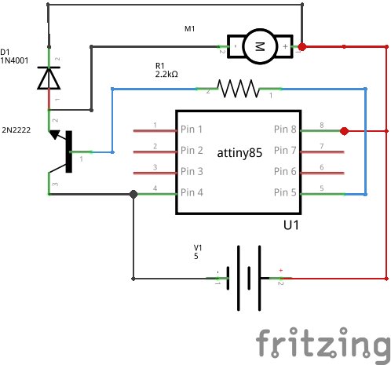
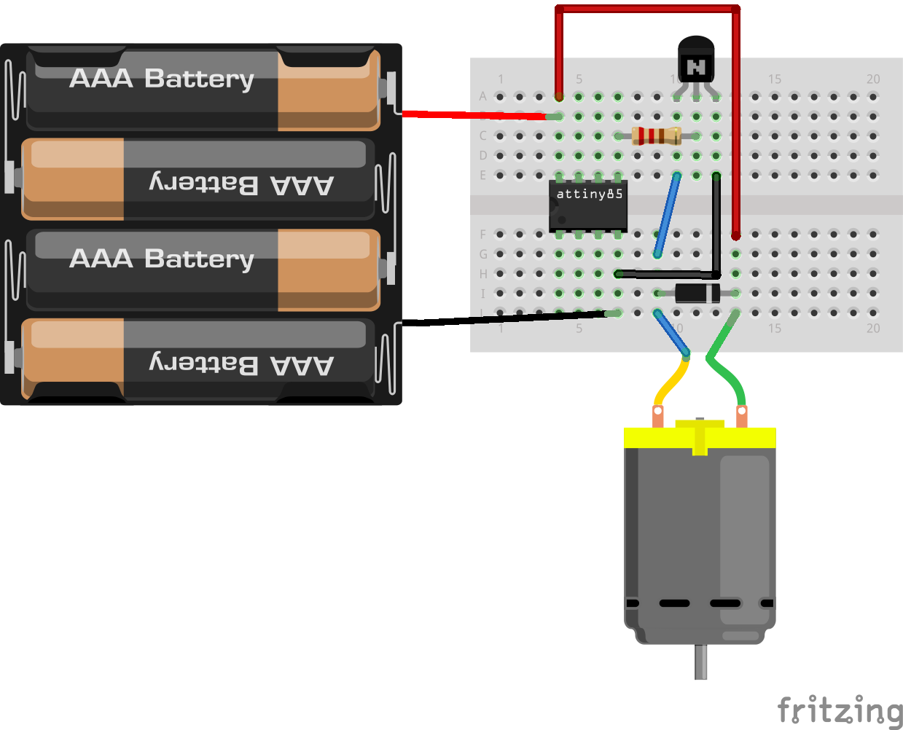
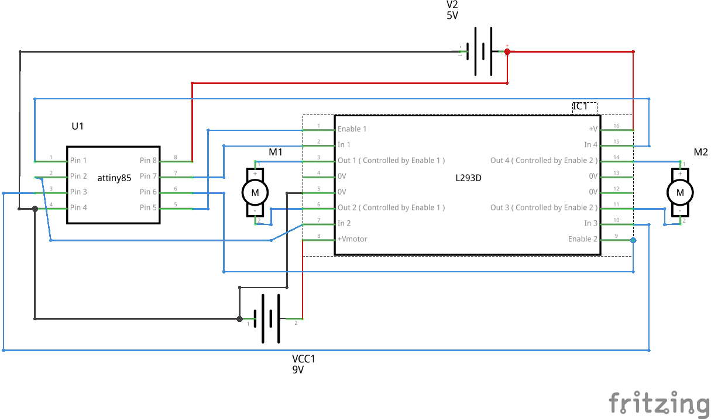
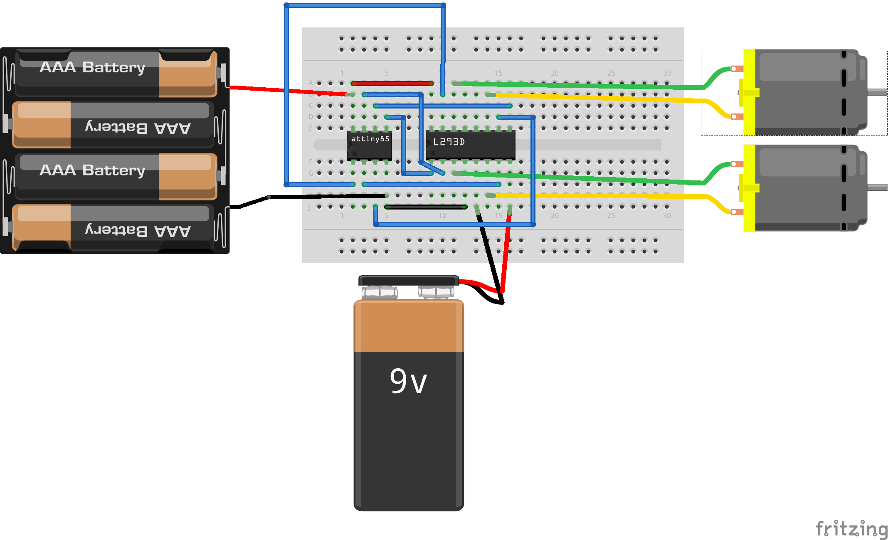
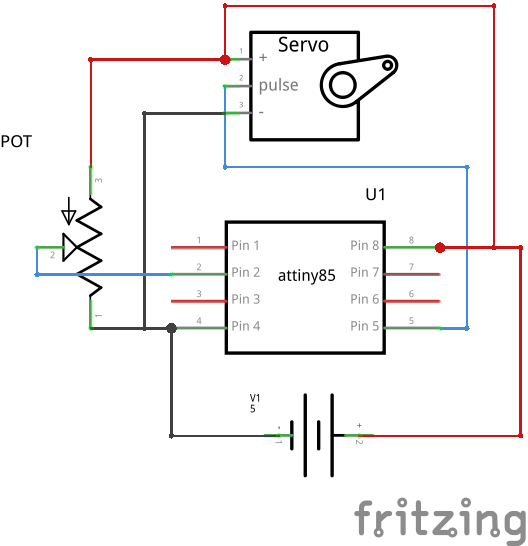
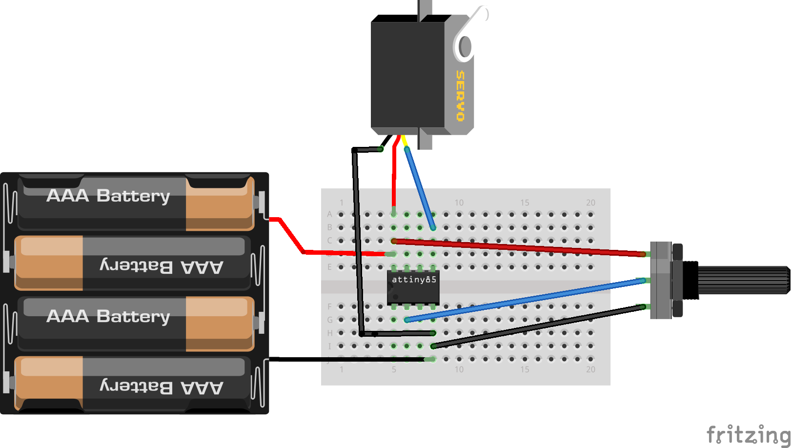

Interfacing motors
------------------

DCmotor and Transistor
~~~~~~~~~~~~~~~~~~~~~~

Overview of the experiment
^^^^^^^^^^^^^^^^^^^^^^^^^^

The Anuduino pins are great for driving LEDs however if we hook
up something that requires more power, We need an external transistor.
Here we will use a transistor to control a small DCmotor. A transistor
is incredibly useful. It switches a lot of current using a much smaller
current. A transistor has 3 pins. For a negative type(NPN) transistor,
We connect our load to collector and the emitter to ground. Then when
a small current flows from base to the emitter, a current will flow
through the transistor and our motor will spin. Here we are using a
P2N2222AG transistor.

Components required
^^^^^^^^^^^^^^^^^^^

- Breadboard     x1
- Attiny85       x1
- DCmotor        x1
- Tranistor(P2N2222) x1
- Diode(1N4007)      x1
- Resistor(2.2k)     x1
- powersupply(5v)

Schematic
^^^^^^^^^

Circuit Diagram
^^^^^^^^^^^^^^^

Code
^^^^

.. code-block::  c

	int motorPin = 0;  // define the pin the motor is connected to

	/*
	 * setup() - this function runs once when you turn your Anuduino on
	 * We set the motors pin to be an output (turning the pin high (+5v) or low    (ground) (-))
	 * rather than an input (checking whether a pin is high or low)
	 */
	void setup()
	{
	 pinMode(motorPin, OUTPUT);
	}

	/*
	 * loop() - this function will start after setup finishes and then repeat
	 * we call a function called motorOnThenOff()
	 */

	void loop()                     // run over and over again
	{
	 motorOnThenOff();
	 //motorOnThenOffWithSpeed();
	 //motorAcceleration();
	}

	/*
	 * motorOnThenOff() - turns motor on then off
	 * (notice this code is identical to the code we used for
	 * the blinking LED)
	 */
	void motorOnThenOff(){
	  int onTime = 2500;  //the number of milliseconds for the motor to turn on
	  int offTime = 1000; //the number of milliseconds for the motor to turn off

	  digitalWrite(motorPin, HIGH); // turns the motor On
	  delay(onTime);                // waits for onTime milliseconds
	  digitalWrite(motorPin, LOW);  // turns the motor Off
	  delay(offTime);               // waits for offTime milliseconds
	}

	/*
	 * motorOnThenOffWithSpeed() - turns motor on then off but uses speed values as well
	 * (notice this code is identical to the code we used for
	 * the blinking LED)
	 */
	void motorOnThenOffWithSpeed(){

	  int onSpeed = 200;  // a number between 0 (stopped) and 255 (full speed)
	  int onTime = 2500;  //the number of milliseconds for the motor to turn on

	  int offSpeed = 50;  // a number between 0 (stopped) and 255 (full speed)
	  int offTime = 1000; //the number of milliseconds for the motor to turn off

	  analogWrite(motorPin, onSpeed);   // turns the motor On
	  delay(onTime);                    // waits for onTime milliseconds
	  analogWrite(motorPin, offSpeed);  // turns the motor Off
	  delay(offTime);                   // waits for offTime milliseconds
	}

	/*
	 * motorAcceleration() - accelerates the motor to full speed then
	 * back down to zero
	*/
	void motorAcceleration(){
	  int delayTime = 50; //milliseconds between each speed step

	  //Accelerates the motor
	  for(int i = 0; i < 256; i++){ //goes through each speed from 0 to 255
	    analogWrite(motorPin, i);   //sets the new speed
 	   delay(delayTime);           // waits for delayTime milliseconds
	  }

	  //Decelerates the motor
	  for(int i = 255; i >= 0; i--){ //goes through each speed from 255 to 0
	    analogWrite(motorPin, i);   //sets the new speed
	    delay(delayTime);           // waits for delayTime milliseconds
	  }
	}

Two DCmotors spinning
~~~~~~~~~~~~~~~~~~~~~

Overview of the experiment
^^^^^^^^^^^^^^^^^^^^^^^^^^

The spinning of the motors in forward as well as backward direction can also
be achieved using the L293d motor driver. The L293d is a dual H-bridge motor
driver integrated circuit which can control a set of two DC motors simultaneously
in any direction. In this experiment, we are rotating the motors both in forward,
both in backward and one forward-one backward directions. If these two motors
are used on a robot, one can achieve forward, backward as well as circular motion
of the robot. The code here achieves each type of motion for 8 seconds with 2
second breaks between each. The time periods are obtained by using the delay function.

Components required
^^^^^^^^^^^^^^^^^^^

- Breadboard             x1
- Attiny85               x1
- L293d-motor-driver IC  x1
- Dcmotor                x2
- powersupply(5v)        x1
- powersupply(12v)       x1

Schematic
^^^^^^^^^

Circuit Diagram
^^^^^^^^^^^^^^^

Code
^^^^

.. code-block:: c

    // @Author_Nivedita Tigadi, Piyush Mahajan, Samridha Kumar
    //2014_Internship IIT-Bombay.

    void setup()
    {
  pinMode(0,OUTPUT);
  pinMode(1,OUTPUT);
  pinMode(2,OUTPUT);
  pinMode(3,OUTPUT);
  pinMode(4,OUTPUT);
  pinMode(5,OUTPUT);
    }

    void loop()
    {
  movefront();
  delay(2000);
  circular();
  delay(2000);
  moveback();
  delay(2000);
    }

    void movefront()
    {
  digitalWrite(0,LOW);
  digitalWrite(1,LOW);
  digitalWrite(2,HIGH);
  digitalWrite(3,LOW);
  digitalWrite(5,HIGH);
  digitalWrite(4,LOW);
  digitalWrite(0,HIGH);
  digitalWrite(1,HIGH);
  delay(8000);
  digitalWrite(0,LOW);
  digitalWrite(1,LOW);
    }

    void moveback()
    {
  digitalWrite(0,LOW);
  digitalWrite(1,LOW);
  digitalWrite(2,HIGH);
  digitalWrite(3,LOW);
  digitalWrite(4,HIGH);
  digitalWrite(5,LOW);
  digitalWrite(0,HIGH);
  digitalWrite(1,HIGH);
  delay(8000);
  digitalWrite(0,LOW);
  digitalWrite(1,LOW);
    }

    void circular()
    {
  digitalWrite(0,LOW);
  digitalWrite(1,LOW);
  digitalWrite(3,HIGH);
  digitalWrite(2,LOW);
  digitalWrite(4,HIGH);
  digitalWrite(5,LOW);
  digitalWrite(0,HIGH);
  digitalWrite(1,HIGH);
  delay(8000);
  digitalWrite(0,LOW);
  digitalWrite(1,LOW);
    }

Steppermotor-Anuduino
~~~~~~~~~~~~~~~~~~~~~

Overview of the experiment
^^^^^^^^^^^^^^^^^^^^^^^^^^

In this project, We are going to interface our anuduino with
steppermotor. We are controlling the direction of the motor
with a potentiometer. The potentiometer regulates the direction
of steppermototr.

Components required
^^^^^^^^^^^^^^^^^^^

- Breadboard          x1
- Attiny85            x1
- Potentiometer(10k)  x1
- Powersupply         x1
- Steppermotor        x1

Schematic
^^^^^^^^^

Circuit Diagram
^^^^^^^^^^^^^^^

Code
^^^^

.. code-block::  c

    //@Author_Nivedita Tigadi.

	int analogPin = 3;   // potentiometer connected to adc 3
	int val = 0;         // variable to store the read value
	int aref = 0;
	int servoPin = 0; //Steppermotor pin connected to pin 0

	void setup()
	{
	  pinMode(servoPin, OUTPUT);   // sets the pin as output
	}

	void loop()
	{
	  val = analogRead(analogPin);   // read the input pin

	  analogWrite(servoPin,val/4);
	}

