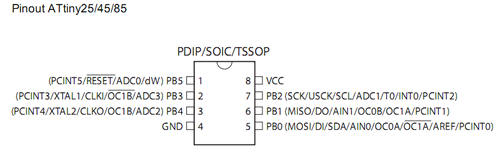
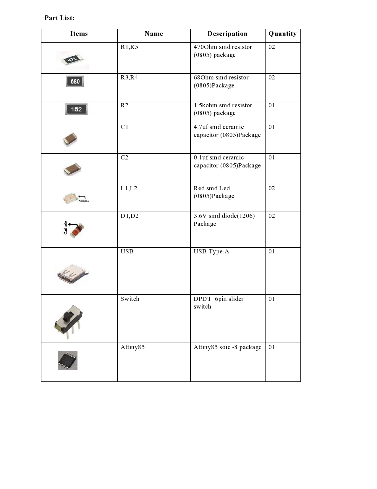
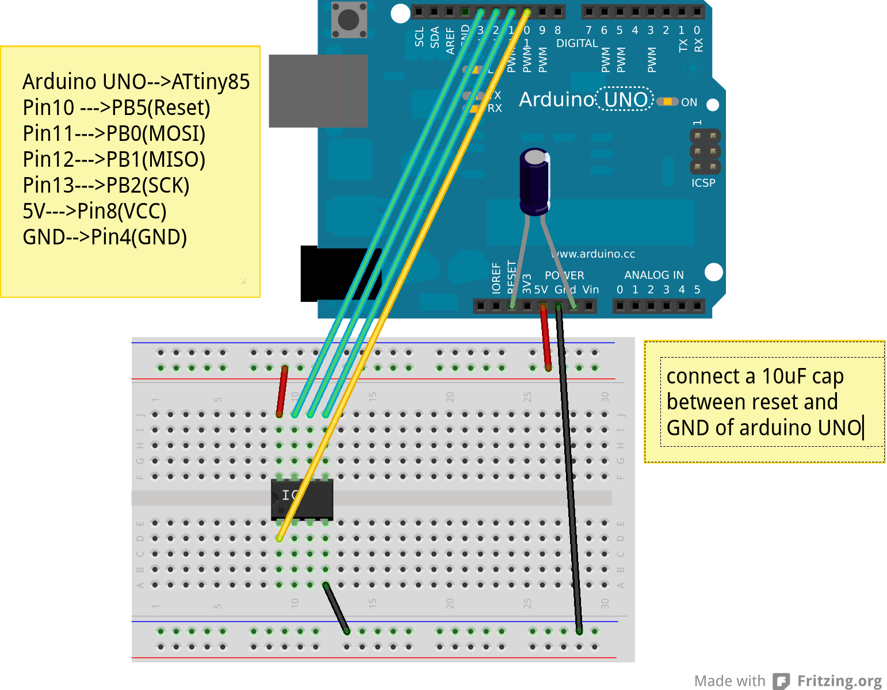
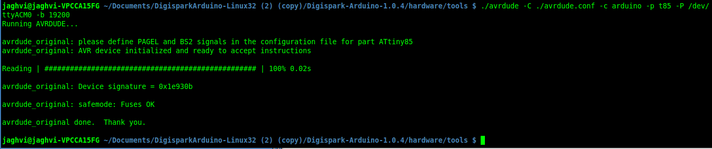

The Anuduino Platform
=====================

Pin Layout of ATtiny85
----------------------

Hardware Requirements
---------------------

Parts List
~~~~~~~~~~

Anuduino Circuit Diagram
~~~~~~~~~~~~~~~~~~~~~~~~

.. .. image:: ../images/attiny85_1_.png
   :width: 80%

Anuduino Board Schematic Diagram
~~~~~~~~~~~~~~~~~~~~~~~~~~~~~~~~

.. .. image:: ../images/attiny85_schematic_1_\(3\).png
  :width: 80%

Software Requirements
----------------------

#. `arduinoIDE <http://arduino.cc/en/Main/Software>`_  Arduino IDE to use arduino-UNO as ISP to flash bootloader and set fuses of ATtiny85 chip.

#. `Bootloader <https://github.com/Bluebie/micronucleus-t85/>`_  This repository contains the source of bootloader to be flashed on ATtiny85.

#. `DigisparkIDE <http://digistump.com/wiki/digispark/tutorials/connecting>`_ ArduinoIDE integrated with Digispark libraries is required to run programs on your DIY project Anuduino.

 It also contains all the tools needed to programme your chip including **avrdude** binary and **micronucelus** binary.

.. note:: Note all the possible errors you might encounter while assembling your circuit are given below under errors heading.

Arduino as ISP
--------------

#. `arduinoIDE <http://arduino.cc/en/Main/Software>`_ Arduino IDE 1.04 version to use arduino-UNO as ISP to program your ATtiny85 chip.
#. Plug in your arduino board
#. File-->Examples-->ArduinoISP
#. Tools-->Board-->Arduino UNO
#. Tools-->Serial Port-->/dev/ttyACM*
#. Upload the sketch on your arduinoUNO.
#. Now you can use it to burn bootloader on your Attiny85 chip.
#. `ArduinoISP Tutorial <http://www.google.com/url?q=http%3A%2F%2Fpdp11.byethost12.com%2FAVR%2FArduinoAsProgrammer.htm&sa=D&sntz=1&usg=AFQjCNE7KJzWFBbjRhLtpMYrmUypxO8VHQ>`_

Programming ATTiny85 with Arduino
---------------------------------

#. ArduinoUno uses SPI protocol .To know more on this `click here <http://www.google.com/url?q=http%3A%2F%2Fpdp11.byethost12.com%2FAVR%2FArduinoAsProgrammer.htm&sa=D&sntz=1&usg=AFQjCNE7KJzWFBbjRhLtpMYrmUypxO8VHQ>`_

 Make the following 6 connections on your breadboard between ArduinoUNO and ATtiny85-20PU.Make sure your connections are firm. Improper connections is the major issue generating errors.

**RECHECK CONNECTIONS**

 +------------------------+------------+----------+
 |       PINS             | Attiny85   |ArduinoUNO|
 |                        |            |          |
 +========================+============+==========+
 |MOSI                    |PB0         |11        |
 +------------------------+------------+----------+
 |MISO                    |PB1         |12        |
 +------------------------+------------+----------+
 |SCK                     |PB2         |13        |
 +------------------------+------------+----------+
 |RESET                   |PB5         |10        |
 +------------------------+------------+----------+
 |VCC                     |Pin8        |5V        |
 +------------------------+------------+----------+
 |GND                     |Pin4        |GND       |
 +------------------------+------------+----------+

.. warning:: If you are programming with Arduino UNO then use a **10uF** capacitor between RESET and GND of arduino UNO.

#. `Why do you need a capacitor ? <http://forum.arduino.cc/index.php/topic,104435.0.html>`_

#. Next CHECK if you have made proper wired connections between Arduino UNO and ATtiny85 chip prior to burning bootloader or setting fuses of your chip .

#. For this your need avrdude binary and avrdude.conf file which is available in the package Digispark Integrated Arduino IDE (`available here <http://digistumpcom/wiki/digispark/tutorials/connecting>`_ )

#. `cd` to the directory  DigisparkArduino-Linux32/Digispark-Arduino-1.0.4/hardware/tools/
    Here you will find the avrdude and avrdude.conf file

#. Next run this command in terminal and see that the device signature matches that of Attiny85 (**0x1e930b**). ::

	./avrdude -C ./avrdude.conf -b 19200 -c arduino -p t85 -P /dev/ttyACM0

.. note:: change the port to your port /dev/ttyACM* or /dev/ttyUSB* or you might get errors.

Burning micronucleus.hex and setting fuses
------------------------------------------

* Download the following `repository <https://github.com/Bluebie/micronucleus-t85/>`_ which contains the micronucelus bootloader.

Uploading BOOTLOADER
~~~~~~~~~~~~~~~~~~~~

Before you start anything ,there are two versions of bootloader.

* **First** (NORMAL) is : micronucleus-1.06.hex .In this version there is a 5 seconds delay prior to execution of  already uploaded sketch.Within this 5sec the anuduino checks whether you have a new programme to overwrite already existing programme on the chip or if not it starts the programme  already uploaded after a **5 seconds** delay.For eg: say you had programmed your chip to blink led on PB0. Now if you plug in your device after some time, it will take 5 seconds for your led to start blinking.

* **Second** (JUMPER) : Now if every second is crucial to your project and you can't wait for your programme to start after 5 seconds ,there is this another version micronucleus-1.06-jumper-v2-upgrade.hex

Bootloader is already available in the IDE you downloaded .It is in the DigisparkArduino-Linux32/DigisparkArduino-1.0.4/hardware/digispark/bootloaders/micronucleus/ folder or you can also obtain the latest version from `micronucelus-t85 repository <https://github.com/Bluebie/micronucleus-t85/tree/master/firmware/releases>`_.

Uploading the NORMAL version
+++++++++++++++++++++++++++++

.. note:: change the paths in the following commands within  quotes(" ")to where your downloaded IDE folder exists.

#. `cd` to the directory  `DigisparkArduino-Linux32/Digispark-Arduino-1.0.4/hardware/tools/` Here you will find the avrdude and avrdude.conf file

#. Next run this command in terminal (This will upload the bootloader already available in the ArduinoIDE ::

		./avrdude -C avrdude.conf -P /dev/ttyACM0 -b 19200 -c arduino -p t85 \
		-U flash:w:"/home/DigisparkArduino-Linux32/Digispark-Arduino-1.0.4\
		/hardware/digispark/bootloaders/micronucleus/micronucleus-1.06-upgrade.hex"

#. This will burn the bootloader on your chip.

#.  Next step is to set appropriate fuses.

Uploading the JUMPER version
++++++++++++++++++++++++++++

#. Use the latest version of this bootloader available at `micronucelus repository <https://github.com/Bluebie/micronucleus-t85/tree/master/firmware/releases>`_.You can also copy the bootloader hex file from here and paste it in the IDE's bootloader folder to keep track.

#. Upload micronucleus1.06-jumper-v2.hex from micronucelus-t85/firmware/releases folder.

#. Set path in the following command to where your bootloader hex file is located. ::

	./avrdude -C avrdude.conf -P /dev/ttyACM0 -b 19200 -c arduino -p t85 -U \
	flash:w:"/home/micronucleus-t85-master/firmware/releases/micronucleus-1.06-upgrade.hex"

Setting fuses of the attiny85-20PU
~~~~~~~~~~~~~~~~~~~~~~~~~~~~~~~~~~

Now just like bootloader versions we have two different fuse settings as well

**First** In this case you can still programme your chip using ISP programmer but you will have just 5 I/O excluding the reset pin(reset pin disabled as I/O).
These fuse settings **won't** work with Jumper version of bootloader.Jumper version requires a jumper between the resest pin and GND to upload the programme.

**Second** In which there are 6 I/O pins available including reset pin (reset pin enabled).You get 6 I/O but at a cost that you can't reprogramme your chip using any ISP programmer now. You will need a HVSP. You can use this setting for **both** bootloader versions ,Normal as well as Jumper version. Reset Pin acts as weak (I/O).

Fuse setting(Reset **disabled** as I/O)
++++++++++++++++++++++++++++++++++++++++

 .. note:: These fuses setting will not enable reset pin (ATTINY85 pin 1) as I/O, so you only have 5 I/O instead of 6 I/O

 .. image:: ../images/resetdisabled.png
     :width: 100%

* `cd` to the directory  DigisparkArduino-Linux32/Digispark-Arduino-1.0.4/hardware/tools/
    Here you will find the avrdude and avrdude.conf file
*  Run the  following command in terminal ::

	./avrdude -C avrdude.conf -p t85 -c arduino -P /dev/ttyACM0 -b \
	19200 -U lfuse:w:0xe1:m -U hfuse:w:0xdd:m -U efuse:w:0xfe:m

Fuse setting(Reset **enabled** as I/O)
+++++++++++++++++++++++++++++++++++++++
 .. image:: ../images/resetenabled.png
    :width: 80%

 .. warning:: If you use the above fuse settings you can't reprogramme your IC until you have a High volt fuse resetter .This is because reset pin is enabled as I/O and you can't programme it using ISP.

*  Set fuses to enable the reset pin to be used as I/O  lfuse:0xe1	**hfuse:0x5d** efuse:0xfe

* `cd` to the directory  `DigisparkArduino-Linux32/Digispark-Arduino-1.0.4/hardware/tools/`. Here you will find the avrdude and avrdude.conf file.

*  Run the following command in terminal ::

	./avrdude -C avrdude.conf -p t85 -c arduino -P /dev/ttyACM0 -b 19200 -U\
	 lfuse:w:0xe1:m -U hfuse:w:0x5d:m -U efuse:w:0xfe:m

*  Now if you are done with the above two steps (burning bootloader and setting fuses) you are ready to upload sketches.

 After the above two steps are accomplished ,make the following USB connections (only if you don't have your own PCB) and follow the next step.

USB Connections
---------------

 .. image:: ../images/breadboard_bb.jpg
	:width: 80%

Device Detection
----------------
#. A vendor ID is necessary for developing a USB product.

run command **dmesg** or **tailf /var/log/syslog** in terminal to check the vendorID and productID

 .. image:: ../images/devicedetected.png
	:width: 80%

Setting rules in udev to avoid assertion errors
-----------------------------------------------

#. Go to /etc/udev/rules.d/ with root privileges.

#. gedit 49-micronucelus.rules and add the following lines ::

	SUBSYSTEMS=="usb", ATTRS{idVendor}=="16d0", ATTRS{idProduct}=="0753",\
	MODE:="0666"
	KERNEL=="ttyACM*", ATTRS{idVendor}=="16d0", ATTRS{idProduct}=="0753",\
	MODE:="0666", ENV{ID_MM_DEVICE_IGNORE}="1"

#. Also add 99-digiusb.rules in /etc/udev/rules.d/

#. gedit 99-digiusb.rules and add the following lines ::

	KERNEL=="hiddev*", ATTRS{idVendor}=="16c0", ATTRS{idProduct}=="05df", SUBSYSTEM=="usb"

#. For more info  visit `Udev rules setting <https://github.com/Bluebie/micronucleus-t85/wiki/Ubuntu-Linux>`_

Uploading Programme
-------------------

* `DigisparkIDE <http://digistump.com/wiki/digispark/tutorials/connecting>`_ ArduinoIDE integrated with Digispark libraries is required to run programs on your DIY anuduino project.

Normal Version of Bootloader
~~~~~~~~~~~~~~~~~~~~~~~~~~~~~~

#. Board--->Digispark(TinyCore)

#. Programmer--->Digispark

.. note:: **DO NOT** plug the device until asked

* Click Compile the code to check if the code exceeds 6Kb.

#. Click Upload (IDE will ask to plug int the device within sixty seconds)

 .. image:: ../images/upload_successful.png
	:width: 100%

#. Now Plug anuduino

#. If upload was not successful then you will get error message.Try to repeat the process.

 .. image:: ../images/uploadfailed.png
	:width: 90%
	:scale: 70%
	:height: 1000

Jumper Version of Bootloader
~~~~~~~~~~~~~~~~~~~~~~~~~~~~~
#. Jumper version removes 5 sec delay.

#. Board--->Digispark(TinyCore)

#. Programmer--->Digispark

#. Upload (IDE will ask to plug int the device within sixty seconds)

#. Connect PB5(Reset) to GND using a jumper if you need to upload sketch.

#. Plug anuduino

#. If successful deplug your device, remove the jumper wire between reset pin and GND, and replug the device, Your programme will start executing instantaneously **without 5 seconds** delay.

Uploading from commandline
--------------------------

How to use the micronucelus command line tool:

#. You can either use the **micronucelus** binary already available in the `Digispark-Arduino IDE <http://digistump.com/wiki/digispark/tutorials/connecting>`_ which you must have already downloaded by now.

Go to DigisparkArduino-Linux32/Digispark-Arduino-1.0.4/hardware/tools folder and run the following command in terminal ::

	sudo ./micronucleus --run Blink.hex

or if your hex file is stored elsewhere then ::

	sudo ./micronucelus --run /home/jaghvi/program/Blink.hex

**OR** you can

Download micronucelus-t85 folder from `github <https://github.com/Bluebie/micronucleus-t85/>`_ (you might have this already ,micronucelus bootloaderhex files were used from this repo)

 .. image:: ../images/commandlineupload.png
     :width: 80%

#. In that folder go to commandline folder and do **make**
#. A micronucelus binary is formed.
#. You can see micronucelus --help to know all the options.
#. Run the following command to upload the hex file.  ::

	sudo ./micronucleus --run Blink.hex

If you get this error try to run it again ::

 >> Abort mission! -32 error has occured ...

 >> Please unplug the device and restart the program.

Burn cdc232.hex
~~~~~~~~~~~~~~~

#. To enumerate anuduino as USB serial device run this command ::

	sudo ./micronucleus micronucleus-t85-master/commandline/cdc232.hex

run command **dmesg** in terminal to enumerate the device as /dev/ttyACM*

ERRORS encountered
------------------

Error when using  ISP programmer
~~~~~~~~~~~~~~~~~~~~~~~~~~~~~~~~

.. note::  All the errors encountered in avrdude are mainly due to poor connections between ISP programmer and ATtiny85
           Redo your connections and see that no wire is loose.

**Error**

This error occurs as your arduinoUNO might be on a serial port other than /dev/ttyACM0 ::

	avrdude: ser_open(): can't open device "/dev/ttyACM0": No such file or directory
	ioctl("TIOCMGET"): Invalid argument

Avrdude output ::

	avrdude: please define PAGEL and BS2 signals in the configuration file for part ATtiny85
	avrdude: AVR device initialized and ready to accept instructions

	Reading | ################################################## | 100% 0.02s

	avrdude: Device signature = 0x000000
	avrdude: Yikes!  Invalid device signature.
		 Double check connections and try again, or use -F to override
		 this check.

**Error**

.. note::  If baud rate is note set properly then stk500 error is encountered.

This error also occours if capacitor is not used in case you are programming with Arduino UNO. ::

	avrdude: stk500_getparm(): (a) protocol error, expect=0x14, resp=0x14

	avrdude: stk500_getparm(): (a) protocol error, expect=0x14, resp=0x01
	avrdude: stk500_initialize(): (a) protocol error, expect=0x14, resp=0x10
	avrdude: initialization failed, rc=-1
		 Double check connections and try again, or use -F to override
		 this check.

**Error** ::

	avrdude: stk500_getsync(): not in sync: resp=0xe0

Errors while making USB connection
~~~~~~~~~~~~~~~~~~~~~~~~~~~~~~~~~~

**Error**

Run **dmesg** or **tailf /var/log/syslog** .Following error might occur due to number of reasons.If you have used a faulty resistor value or if the zener diodes used are of values other than 3.6V. Check if all the connections are proper specially consulting D- and D+ lines.

 .. image:: ../images/error_usbconnection.png
	:width: 100%

**Error**

Bad permissions generally cause the ::

	Abort mission! -1 error has occured ...
	>> Please unplug the device and restart the program.

"micronucleus: library/micronucleus_lib.c:63: micronucleus_connect: Assertion 'res >= 4' failed.” is also a result of bad permissions.

So set the required rules in /etc/udev/rules.d/ as explained above to avoid these errors. `Linux troubleshooting <http://digistump.com/wiki/digispark/tutorials/linuxtroubleshooting>`_

Serial Monitor
--------------
You can either use Digisparks official monitor or use Bluebie's digiterm written in ruby.

Digiterm
~~~~~~~~~

#. `Digiterm: <http://digistump.com/wiki/digispark/tutorials/digiusb>`_ It is a Serial Monitor written in ruby.You need certain packages to install it.Click this link to know more.

#. To install digiterm do ::

	gem install digiusb

DigiUSB monitor
~~~~~~~~~~~~~~~

#. The Digispark integrated arduinoIDE has DigiUSB libraries which has the DigiUSB monitor working like a serial monitor.

DigiUSB monitor has two more binaries send and receive.

* send - this allows you to send data/text to your board  with DigiUSB - run with –help to see all options

* receive- this allows you to receive data/text from your board(anuduino) with DigiUSB - run with –help to see all options.

See the DigiUSB→Echo example and the applications in the “Example Programs” folder for an example of how to use the DigiUSB library.

To output your data in a text file run the receive binary using this command ::

$ ./receive >> output.txt

