Getting started with Anuduino
-----------------------------

Basic Input-Output programming
==============================

LED blink program
~~~~~~~~~~~~~~~~~

Overview of the experiment
^^^^^^^^^^^^^^^^^^^^^^^^^^

LEDs (light emitting diodes) are used in all sorts of clever things which 
is why we have induced them in the kit. We will start off with something 
very simple, turning one ON and OFF, repeatedly,producing a pleasant blinking 
effect.To get started, grab the parts listed below and assemble the circuit. 
Once the circuit is assembled you will need to upload the program on Attiny85. 
To upload the program plug your Anuduino into your USB port. Then select 
the proper board in Tools>Board>anuduino, and select the programmer in 
Tools>Programmer>Anuduino.Next upload the program by going to File>Upload*(ctrl+U). 
Finally, you will get the pleasant blinking effect.

Component required
^^^^^^^^^^^^^^^^^^

- Breadboard   x1
- Attiny85     x1
- LED          x1
- Resistor(1K) x1
- Wires
- Powersupply(5V)

Schematic
^^^^^^^^^

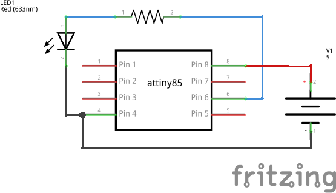

Circuit Diagram
^^^^^^^^^^^^^^^

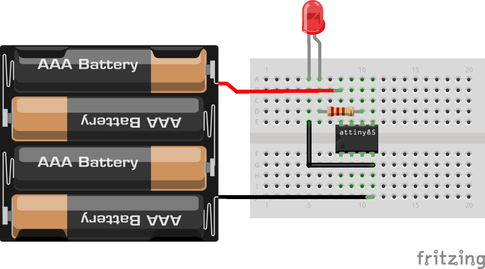

Code
^^^^

.. code-block:: c

	//the setup routine runs once when you press reset:
	void setup() {                
	// initialize the digital pin as an output.
	  pinMode(0, OUTPUT); //LED on Model 
	}

	// the loop routine runs over and over again forever:
	void loop() {
	  digitalWrite(0, HIGH);   // turn the LED on (HIGH is the voltage level)
	  delay(1000);             // wait for a second
	  digitalWrite(0, LOW);    // turn the LED off by making the voltage LOW
  	  delay(1000);             // wait for a second
	}

Controlling LED through switch
~~~~~~~~~~~~~~~~~~~~~~~~~~~~~~

Overview of the experiment
^^^^^^^^^^^^^^^^^^^^^^^^^^

In this experiment we are going to make the Anuduino to listen and feel. We 
are starting with a simple push button. Wiring up the push button is simple. 
There is one component,the pull up resistor,that might seem out of place. 
This is included because Anuduino doesn't sense the same way we do (ie button 
pressed, button unpressed). Instead it looks at the voltage on 
the pin and decides wheteher it's HIGH or LOW. The button is set up to pull 
the Anuduino's pin LOW when it is pressed, however,when the button is unpressed 
the voltage of the pin will float(causing occasional errors). To get the 
Anuduino to reliably read the pin as HIGH when the button is unpressed, 
we add the pull up resistor. 

Components required
^^^^^^^^^^^^^^^^^^^

- Breadbord        X1
- Pushbutton       X1
- Resistor (1K)    X1
- LED              X1
- Wires
- Powersupply(5V)

Schematic
^^^^^^^^^

.. image:: ../images/2_SWITCH_schem.png
   :scale: 200%

Circuit Diagram
^^^^^^^^^^^^^^^

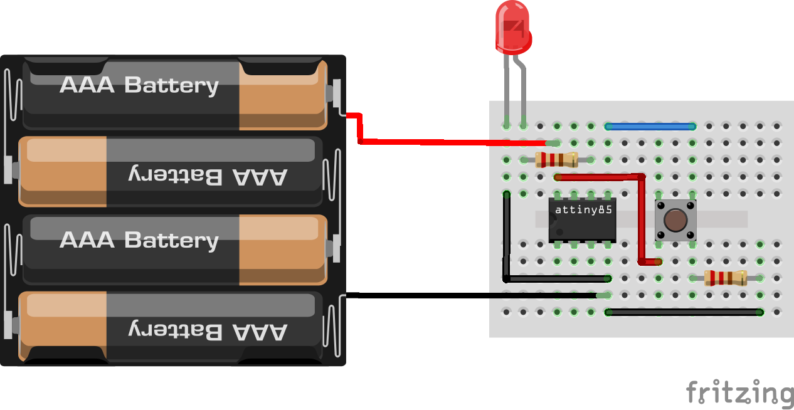

Code
^^^^

.. code-block::  c

   /*
   @Author_Nivedita Tigadi.
   
   Button
 
   Turns on and off a light emitting diode(LED) connected to digital  
   pin 1, when pressing a pushbutton attached to pin 0. 
 
 
   The circuit:
  * LED attached from pin 1 to ground 
  * pushbutton attached to pin 0 from +5V
  * push button is connected to ground through 1k resistor
 
  */
   // constants won't change. They're used here to 
  // set pin numbers:
  const int buttonPin = 0;     // the number of the pushbutton pin
  const int ledPin = 1 ;      // the number of the LED pin

  // variables will change:
  int buttonState = 0;         // variable for reading the pushbutton status

  void setup() {
  // initialize the LED pin as an output:
  pinMode(ledPin, OUTPUT);      
  // initialize the pushbutton pin as an input:
  pinMode(buttonPin, INPUT);     
  }

  void loop(){
  // read the state of the pushbutton value:
  buttonState = digitalRead(buttonPin);

  // check if the pushbutton is pressed.
  // if it is, the buttonState is HIGH:
  if (buttonState == HIGH) {     
    // turn LED on:    
    digitalWrite(ledPin, HIGH);  
  } 
  else {
    // turn LED off:
    digitalWrite(ledPin, LOW); 
  }
  }

Array of LED's
~~~~~~~~~~~~~~

Overview of the experiment
^^^^^^^^^^^^^^^^^^^^^^^^^^

We have blinked one LED, Now it's the time to up the stakes. Lets connect four
LEDs.We also have an opportunity to stretch the anuduino a bit by creating various
lighting sequences. This circuit is also a nice setup to experiment with writing 
your own programs and getting a feel for how the anuduino works.

Components required
^^^^^^^^^^^^^^^^^^^

- Breadboard         x1
- Attiny85           x1
- LEDs               x4
- resistors(470ohm)  x4
- Powersupply(5V)

Schematic
^^^^^^^^^

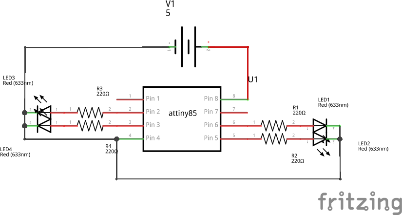

Circuit Diagram
^^^^^^^^^^^^^^^

.. image:: ../images/5_Array-of-LEDs_bb.png
   :scale: 80%

Code
^^^^

.. code-block:: c

	
     // @Author_Nivedita Tigadi.//
     
      void setup() {   
  
        // initialize the following pins as output.
  
          pinMode(0, OUTPUT); //LED on pin 0
          pinMode(1, OUTPUT); //LED on pin 1
          pinMode(3, OUTPUT); //LED on pin 3
          pinMode(4, OUTPUT); //LED on pin 4
    
	}

	// the loop routine runs over and over again forever:
	void loop() {
 	digitalWrite(0, HIGH); // turn the 1st LED on (HIGH is the voltage level)
  	delay(500);   
  	digitalWrite(1, HIGH); // turn the 2nd LED on (HIGH is the voltage level)
	delay(500); 
 	digitalWrite(3, HIGH); // turn the 3rd LED on (HIGH is the voltage level)
  	delay(500);   
 	digitalWrite(4, HIGH); // turn the 4th LED on (HIGH is the voltage level)
 	delay(500);               
 	digitalWrite(0, LOW);  // turn the 1st LED off by making the voltage LOW
	delay(500);  
 	digitalWrite(1, LOW); // turn the 2nd LED off by making the voltage LOW
  	delay(500); 
  	digitalWrite(3, LOW);  // turn the 3rd LED off by making the voltage LOW
	delay(500);   
 	digitalWrite(4, LOW);  // turn the 4th LED off by making the voltage LOW
 	delay(500);            
	}

Pulse-Width Modulation
======================

Controlling luminosity of LED
~~~~~~~~~~~~~~~~~~~~~~~~~~~~~

Overview of the experiment
^^^^^^^^^^^^^^^^^^^^^^^^^^

Anuduino has 3 analog pins which can be used for analog input. These inputs 
take a voltage(0 to 5V) and convert it to a digital number between 0(0 volts) 
and 1023(5 volts) (10 bits of resolution). A very useful device that exploits 
these inputs is a potentiometer. When it is connected with 5 volts across its 
outer pins the middle pin will read some value between 0 and 5 volts dependent 
on the angle to which it is tuned(ie 2.5 volts in the middle). we can then use 
the returned values as a variable in our program. 

Components required
^^^^^^^^^^^^^^^^^^^

- Breadboard          X1
- Attiny85   	      X1
- LED       	          X1
- Potentiometer(10k)  X1
- Resistor(470 ohm)   X1
- Powersupply(5V)

Schematic
^^^^^^^^^

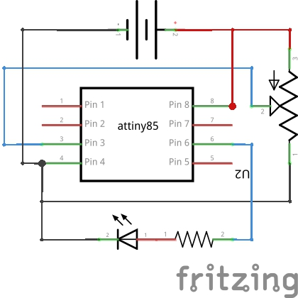

Circuit Diagram
^^^^^^^^^^^^^^^

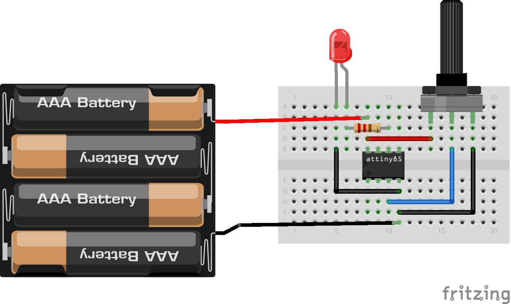

Code
^^^^

.. code-block::  c

    // @Author_Nivedita Tigadi.
    //

	int ledPin = 1;      // LED connected to port 1
	int analogPin = 2;   // potentiometer connected to adc 2
	int val = 0;         // variable to store the read value
	int aref = 0;

	void setup()
	{
 	 pinMode(ledPin, OUTPUT);   // sets the pin as output
	}

	void loop()
	{
	  val = analogRead(analogPin);   // read the input pin
  
	  analogWrite(ledPin,val/4);
	}

Relay
=====

Interfacing relay
~~~~~~~~~~~~~~~~~

Overview of the experiment
^^^^^^^^^^^^^^^^^^^^^^^^^^

In this experiment we are interfacing relay with anuduino. We are
using a transistor to drive current for relay. Whenever relay gets
energized it will ON LED connected to it at the NO pin and when it 
gets de-energized it will turn OFF LED. We can use it for larger loads
also. We have to choose a proper relay.

Components required
^^^^^^^^^^^^^^^^^^^

- Breadboard         x1
- attiny85           x1
- Relay(5V)          x1
- Diode(1N4001)      x1
- Transistor(2N2222) x1
- LED                x1
- Resistors(470 & 2.2k) x1
- Powersupply(5V)

Schematic
^^^^^^^^^

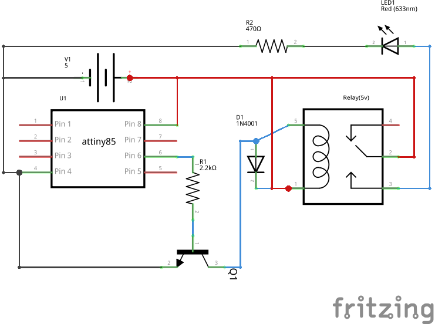

Circuit Diagram
^^^^^^^^^^^^^^^

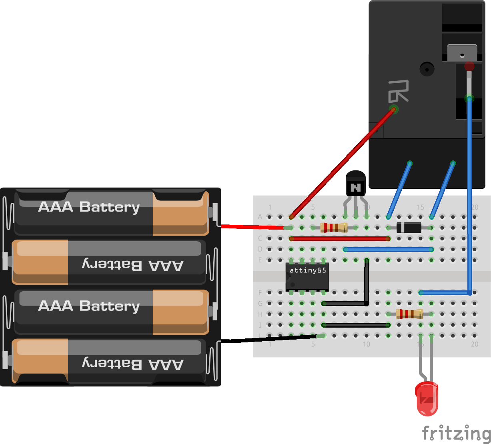

Code
^^^^

.. code-block::  c

     // @Author_Nivedita Tigadi.
     //the setup routine runs once when you press reset:
     
    void setup()
     {   
      pinMode(1, OUTPUT); // initialize the digital pin as an output.
     }

       // the loop routine runs over and over again forever:
    void loop()
    
    {
    
    digitalWrite(1, HIGH);   // turn the LED on (HIGH is the voltage level)
    delay(1000);               // wait for a second
    digitalWrite(1, LOW);    // turn the LED off by making the voltage LOW
    delay(1000);               // wait for a second
    
    }

Other peripherals
=================

RGB-LED
~~~~~~~

Overview of the experiment
^^^^^^^^^^^^^^^^^^^^^^^^^^

We have blinked LED, and now we are going to control colour. Using an 
RGB-LED(actually 3 LEDs in a single housing) we can generate the colour
we wish to see. By the phenomenon of colour mixing, we can generate various
colours through RGB-LED.

Components required
^^^^^^^^^^^^^^^^^^^

- Breadboard       x1
- Attiny85         x1
- RGB-LED          x1
- Resistor(220ohm) x3
- Powersupply(5V)

Schematic
^^^^^^^^^

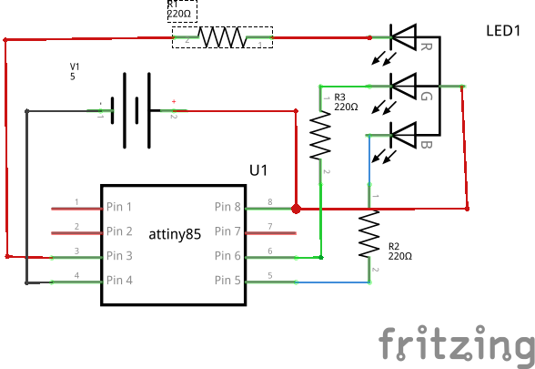

Circuit diagram
^^^^^^^^^^^^^^^

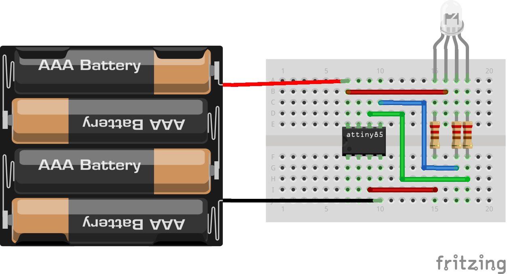

Code
^^^^

.. code-block:: c

	
	
	/*     ---------------------------------------------------------
	 *     |  Experimentation Kit for Anuduino Example Code         |
	 *     |  CIRC-RGB .: Colourful Light :. (RGB LED)             |
 	*     ---------------------------------------------------------
	 * 
	 * We've blinked an LED and controlled eight in sequence now it's time to 
	 * control colour. Using an RGB LED (actual 3 LEDs in a single housing)  
	 * we can generate any colour we wish to see.
	 *
	 * (we'll also use a few programming shortcuts to make the code 
	 * more portable/readable)
 	*/

	//RGB LED pins
	int ledDigitalOne[] = {4, 1, 0}; //the three digital pins of the digital LED 
                                   //4 = redPin, 1 = greenPin, 0 = bluePin

	const boolean ON = LOW;     //Define on as LOW (this is because we use a common 
                            //Anode RGB LED (common pin is connected to +5 volts)
	const boolean OFF = HIGH;   //Define off as HIGH

	//Predefined Colors
	const boolean RED[] = {ON, OFF, OFF};    
	const boolean GREEN[] = {OFF, ON, OFF}; 
	const boolean BLUE[] = {OFF, OFF, ON}; 
	const boolean YELLOW[] = {ON, ON, OFF}; 
	const boolean CYAN[] = {OFF, ON, ON}; 
	const boolean MAGENTA[] = {ON, OFF, ON}; 
	const boolean WHITE[] = {ON, ON, ON}; 
	const boolean BLACK[] = {OFF, OFF, OFF}; 

	//An Array that stores the predefined colors (allows us to later randomly display a         color)
	const boolean* COLORS[] = {RED, GREEN, BLUE, YELLOW, CYAN, MAGENTA, WHITE, BLACK};

	void setup(){
 	 for(int i = 0; i < 3; i++){
  	 pinMode(ledDigitalOne[i], OUTPUT);   //Set the three LED pins as outputs
 	 }
	}

	void loop(){

	/* Example - 1 Set a color
  	 Set the three LEDs to any predefined color
	*/
	   setColor(ledDigitalOne, RED);    //Set the color of LED one

	/* Example - 2 Go through Random Colors
	  Set the LEDs to a random color
	*/
	   randomColor();

	}

	void randomColor(){
 	 int rand = random(0, sizeof(COLORS) / 2);  //get a random number within the range of colors
	  setColor(ledDigitalOne, COLORS[rand]);  //Set the color of led one to a random color
	  delay(1000);
	}

	/* Sets an led to any color
	   led - a three element array defining the three color pins (led[0] = redPin, led[1] = greenPin, led[2] = bluePin)
	   color - a three element boolean array (color[0] = red value (LOW = on, HIGH = off), color[1] = green value, color[2] =blue value)
	*/
	void setColor(int* led, boolean* color){
	 for(int i = 0; i < 3; i++){
	   digitalWrite(led[i], color[i]);
	 }
	}

	/* A version of setColor that allows for using const boolean colors
	*/
	void setColor(int* led, const boolean* color){
	  boolean tempColor[] = {color[0], color[1], color[2]};
	  setColor(led, tempColor);
	}

Music-Piezo Element
~~~~~~~~~~~~~~~~~~~

Overview of the experiment
^^^^^^^^^^^^^^^^^^^^^^^^^^

To this point we have controlled light, motion. Now its time to tackle sound.
To do this we attach a piezo element to anuduino pin 0. A piezo element makes
clicking sound each time it is pulsed with current. If we pulse it at the right 
frequency (for example 440 times a second to make the note middle A) these clicks will
run together to produce notes. And here our anuduino plays "Twinkle Twinkle Little star".

Components required
^^^^^^^^^^^^^^^^^^^

- Breadboard         x1
- Attiny85           x1
- Piezo-element      x1
- Powerupply(5V) 

Schematic
^^^^^^^^^

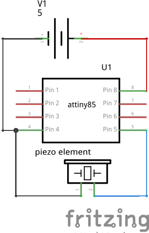

Circuit diagram
^^^^^^^^^^^^^^^

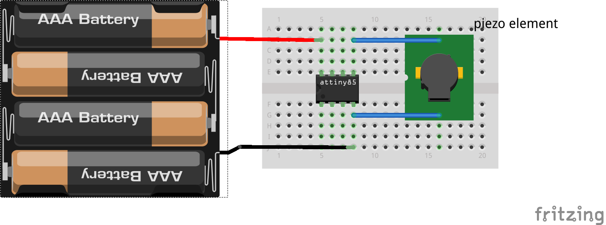

Code
^^^^

.. code-block::  c

	/* Melody
 	* (cleft) 2005 D. Cuartielles for K3
 	*
 	* This example uses a piezo speaker to play melodies.  It sends
 	* a square wave of the appropriate frequency to the piezo, generating
 	* the corresponding tone.
 	*
 	* The calculation of the tones is made following the mathematical
 	* operation:
 	*
 	*       timeHigh = period / 2 = 1 / (2 * toneFrequency)
 	*
 	* where the different tones are described as in the table:
 	*
 	* note 	frequency 	period 	timeHigh
 	* c 	        261 Hz 	        3830 	1915 	
 	* d 	        294 Hz 	        3400 	1700 	
 	* e 	        329 Hz 	        3038 	1519 	
 	* f 	        349 Hz 	        2864 	1432 	
 	* g 	        392 Hz 	        2550 	1275 	
 	* a 	        440 Hz 	        2272 	1136 	
 	* b 	        493 Hz 	        2028	1014	
 	* C	        523 Hz	        1912 	956
 	*
 	* http://www.arduino.cc/en/Tutorial/Melody
 	*/
  
	int speakerPin = 0;

	int length = 15; // the number of notes
	char notes[] = "ccggaagffeeddc "; // a space represents a rest
	int beats[] = { 1, 1, 1, 1, 1, 1, 2, 1, 1, 1, 1, 1, 1, 2, 4 };
	int tempo = 300;

	void playTone(int tone, int duration) {
 	 for (long i = 0; i < duration * 1000L; i += tone * 2) {
	    digitalWrite(speakerPin, HIGH);
	    delayMicroseconds(tone);
 	   digitalWrite(speakerPin, LOW);
	    delayMicroseconds(tone);
	  }
		}
	void playNote(char note, int duration) {
	  char names[] = { 'c', 'd', 'e', 'f', 'g', 'a', 'b', 'C' };
	  int tones[] = { 1915, 1700, 1519, 1432, 1275, 1136, 1014, 956 };
  
	  // play the tone corresponding to the note name
	  for (int i = 0; i < 8; i++) {
	    if (names[i] == note) {
	      playTone(tones[i], duration);
	    }
	  }
	}

	void setup() {
	  pinMode(speakerPin, OUTPUT);
	}

	void loop() {
	  for (int i = 0; i < length; i++) {
	    if (notes[i] == ' ') {
	      delay(beats[i] * tempo); // rest
	    } else {
	      playNote(notes[i], beats[i] * tempo);
	    }
    
	    // pause between notes
	    delay(tempo / 2); 
	  }
	}
