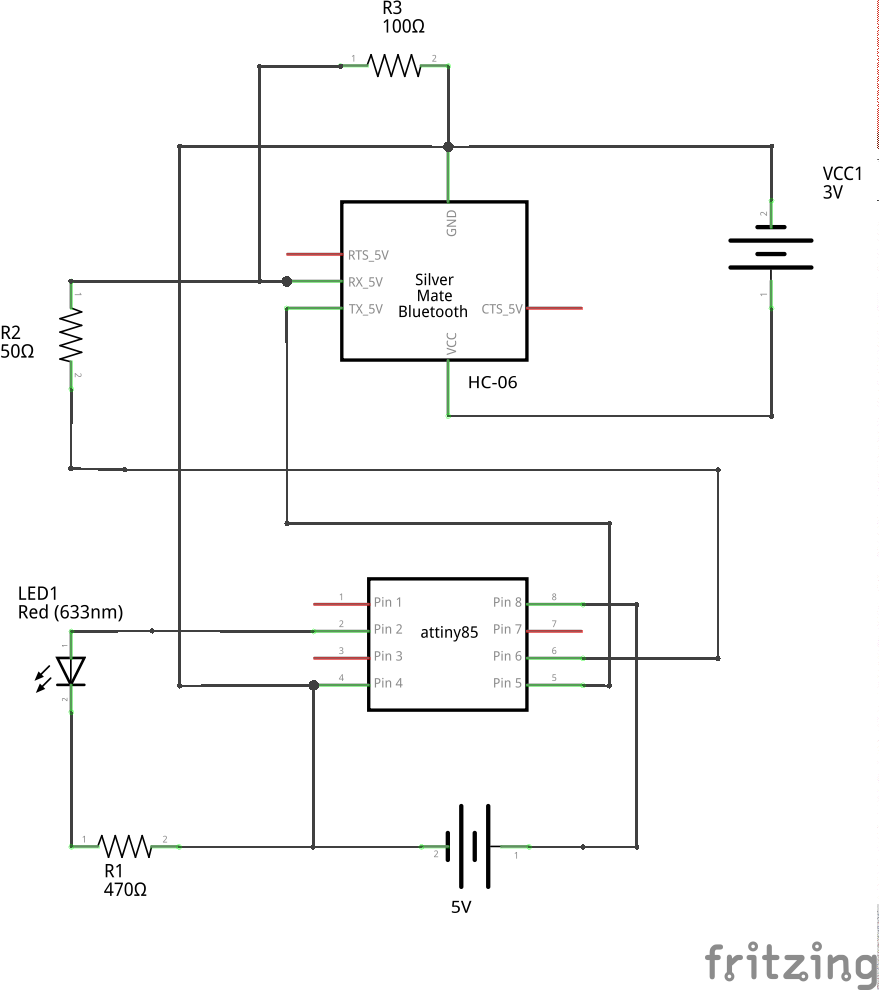
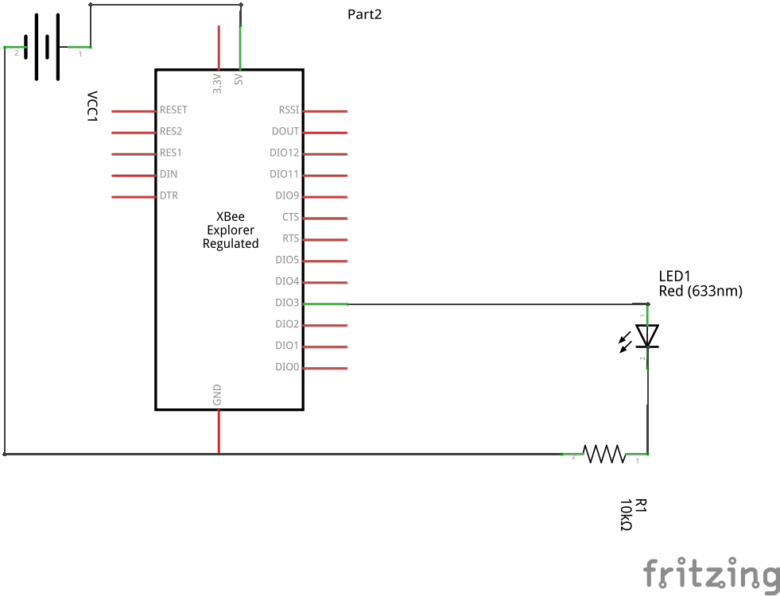
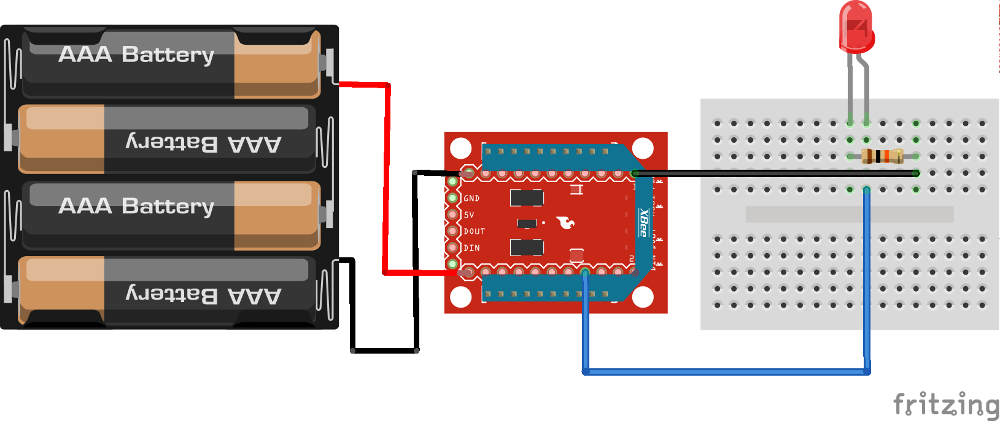
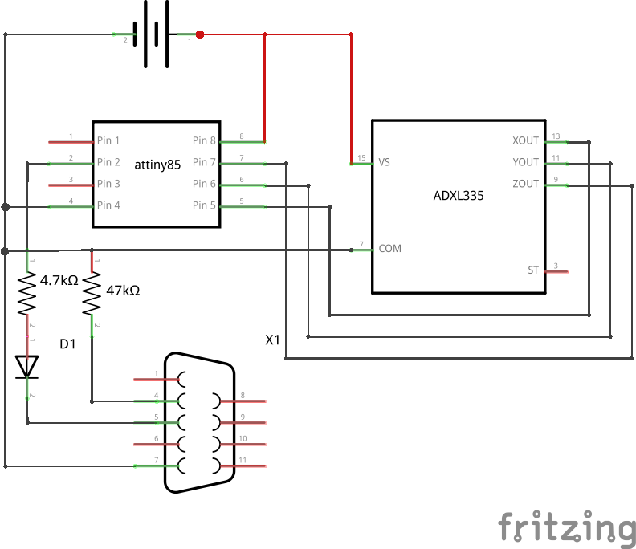
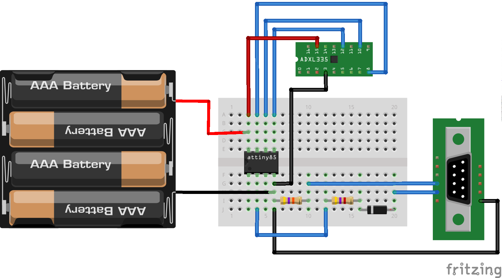

Communication
-------------

Bluetooth Anuduino Interfacing
~~~~~~~~~~~~~~~~~~~~~~~~~~~~~~

Overview of the Experiment
^^^^^^^^^^^^^^^^^^^^^^^^^^

Bluetooth communication has become one of the most widely 
used methods when it comes to data transfer. In this 
experiment we have interfaced a bluetooth module with an
anuduino board to control the led.

We have used HC06 bluetooth module.This module works on 
3.3 V supply.The TX pin on the bluetooth module is directly 
connected to RX on ATtiny85 and the TX on ATtiny85 is 
connected to 50 ohm which is connected to 100 ohm and RX 
on the ATtiny85.The other end of 100 ohm is connected to 
the ground.(Since HC-06 module is not available on fritzing 
we have used another module RN-42 to represent HC-06)

The commands to control the led is sent through the 
'BlueTerm +' app on the android(The application is available
on google playstore).
BlueTerm + has to be downloaded and installed on the phone for 
this project.

Components required
^^^^^^^^^^^^^^^^^^^

- Breadboard              x1
- Attiny85                x1
- Bluetooth module HC-06  x1
- Resistor(10 Kohm)       x1
- Resistor(100 ohm)       x1
- Resistor(50 ohm)        x1
- LED                     x1
- Wires
- Powersupply(5V & 3.3V)

Schematic
^^^^^^^^^

Circuit Diagram
^^^^^^^^^^^^^^^

.. image:: ../images/17_Bluetooth_bb.png
   :scale: 80%

Code
^^^^

.. code-block::  c
	

	#include <SoftSerial.h>
	#include <TinyPinChange.h>

	SoftSerial mySerial(0,1);

	char receivedChar;
	int  LED = 3; // LED on pin 3
	

	//RX on Bluetooth to TX on ATtiny85 through a voltage divider 50ohm
	from ATtiny85 and 100ohm to ground. This is so we can drop the the
	voltage down to 3.3v (roughly)
	// Use blueterm on android to get messages

	void setup()
	{
    	  // Open serial communications and wait for port to open:
	  pinMode(LED, OUTPUT);
	  mySerial.begin(9600);
	  mySerial.println("Welcome to the wonderful world of bluetooth communication");
	  delay(1000);
	  mySerial.println("Sending a '1' will turn on the LED, Sending a '2'
		will turn off the LED");
	  delay(1000);
	  mySerial.println("a '3' will flash the LED");
	}

	void loop() // run over and over
	{
	
	  while (!mySerial.available());   // stay here so long as COM port is empty
	  receivedChar = mySerial.read();
	  if (receivedChar == '1') {
	    digitalWrite(LED, HIGH);
	  }// if it's a 1 turn LED on
	  if (receivedChar == '2') {
	    digitalWrite(LED, LOW);
	  } // if it's a 2 turn LED off
	  if (receivedChar == '3') {
	    for (int i = 0; i < 30; i++) {
	      digitalWrite(LED, HIGH);
	      delay(20);
	      digitalWrite(LED, LOW);
	      delay(20);
	    }
	  } // if it is a 3 flash the LED
	}

Zigbee Interfacing with Anuduino
~~~~~~~~~~~~~~~~~~~~~~~~~~~~~~~~

Overview of the Experiment
^^^^^^^^^^^^^^^^^^^^^^^^^^

In earlier days the application of the wireless technology was limited mostly 
to simple point to point communication only replacing the cable based 
communication systems. The entire communication system itself became complex 
after the introduction of the computer and communication system based on 
computers. Several complex networked communication systems like LAN, WAN, 
PAN etc. came into use. To replace the cable based network communication system 
with wireless technology demands the design of complex wireless devices and 
wireless network protocols. The ZigBee is the name of a wireless protocol 
maintained by the IEEE 802.15 standard. This is a protocol specified for 
wireless Personal Area Network (PAN) using low powered wireless transceivers. 
There are already wireless transmitter and receiver modules which can do point to
point communication. The Xbee is the brand name a wireless transceiver device 
introduced by the Digi international which works on the ZigBeeprotocol and can 
form PAN networks. They have an approximate range of 10 to 100 meters and are 
used in industries, scientific fields, medical fields etc.
The Xbee module even though uses complex packet data based Zigbee protocol for
communicating with each other, they can communicate with other devices using 
simplest serial communication protocol and hence they are widely used in 
microcontroller base boards. This tutorial demonstrates how to interface an 
Xbee module with the Arduino board and perform simple transmission and reception.
This is a very basic experiment with the Xbee using only two Xbee modules in which 
one of them transmit the data and another one receives data but controlled using 
the Anuduino board. In this experiment we have shown zigbee communication using 
anuduino.We have used one anuduino board and two xbee modules,one configured as 
coordinator and the other as receiver using XCTU software.At sender side a switch 
is connected to the anuduino.If the switch is closed,the anuduino sends a signal 
via the xbee which energizes a relay at the receiver side and the led glows.If 
switch is open,the signal sent via zigbee turns off the led. The configuration 
of the XBees was done using the X-CTU software.The coordinator XBee was
configured to be in API mode and the router XBee to AT mode.The PAN IDs SHOULD be the
same for both and enable JV for the router XBee.

Component required
^^^^^^^^^^^^^^^^^^

- Breadboard     x2
- Attiny85       x1
- XBeeProSeries2 x2
- XBee Shields   x2
- Switch         x1
- Resistor(10k)  x1
- LED            x1
- Wires
- Powersupply(5V)

Schematic
^^^^^^^^^

**Transmitter**

.. image:: ../images/18_zigbee_Transmitter_schem.png
   :scale: 150%

**Receiver**

Circuit Diagram
^^^^^^^^^^^^^^^

**Transmitter**

.. image:: ../images/18_zigbee_Transmitter_bb.png
   :scale: 80%

**Receiver**

Code
^^^^

.. code-block::  c

	#include <SoftSerial.h>
	#include <TinyPinChange.h>

	SoftSerial xbee(0, 1);

	void setup()
	{
 	 pinMode(2,INPUT);
  	Serial.begin(9600);
  	xbee.begin(9600);
	}

	void loop()
	{
  	if(digitalRead(2)==HIGH)
  	 set(0x5);    //turns on the LED
  	if(digitalRead(2)==LOW)
   	set(0x4);    //turns off the LED
	}
	void set(char value)
	{
 	 xbee.write(0x7E); // Sync up the start byte
  	 xbee.write((byte)0x0);
  	 xbee.write(0x10); // Length LSB
  	 xbee.write(0x17); // 0x17 is the frame ID for sending an AT command
 	 xbee.write((byte)0x0); // Frame ID (no reply needed)
 	 xbee.write((byte)00); // Send the 64 bit destination address
 	 xbee.write((byte)00); // (Sending 0x000000000000FFFF (broadcast))
 	 xbee.write((byte)00);
 	 xbee.write((byte)00);
  	 xbee.write((byte)00);
  	 xbee.write((byte)00);
  	 xbee.write(0xFF);
 	 xbee.write(0xFF);
 	 xbee.write(0xFF); // Destination Network
	 xbee.write(0xFE); // (Set to 0xFFE if unknown)
 	 xbee.write(0x02); // set to 0x)2 to apply these changes
 	 xbee.write('D');  //AT command:D1
 	 xbee.write('3');
 	 xbee.write(value); // Set D1 to be 5 (Digital Out HIGH)
 	 long chexsum = 0x17 + 0xFF + 0xFF + 0xFF + 0xFE + 0x02 + 'D' + '3' + value;
 	 xbee.write( 0xFF - (chexsum & 0xFF)); // Checksum
	}

Serial: Accelerometer using single wire
~~~~~~~~~~~~~~~~~~~~~~~~~~~~~~~~~~~~~~~

Overview of the Experiment
^^^^^^^^^^^^^^^^^^^^^^^^^^

An accelerometer is a device that measures proper acceleration. The proper 
acceleration measured by an accelerometer is not necessarily the coordinate 
acceleration (rate of change of velocity). Instead, the accelerometer sees the 
acceleration associated with the phenomenon of weight experienced by any test 
mass at rest in the frame of reference of the accelerometer device. In this 
experiment we have interfaced an accelerometer ADXL335 with an anuduino board.

The ADXL335 is a small, thin, low power, complete 3-axis accelerometer with 
signal conditioned voltage outputs. The product measures acceleration with a 
minimum full-scale range of ±3g.It can measure the static acceleration of gravity 
in tilt-sensing applications, as well as dynamic acceleration resulting from motion, 
shock, or vibration.

In this experiment,we are using single-wire communication.By declaring a 
<SoftSerial> object with the same pin for Tx and Rx,it is possible to use a 
half duplex (request/response) software serial port using a single I/O. The 
external interface is composed of 2 resistors and a regular diode.This approach 
allows to use the built-in Serial Monitor of the arduino IDE to view the values 
obtained from the experiment.It should be noted that a RS232 port is required 
for this purpose.

Components required
^^^^^^^^^^^^^^^^^^^

- Breadboard              x1
- Attiny85                x1
- ADXL335                 x1
- USB to RS232 cable      x1
- Resistor(47 Kohm)       x1
- Resistor(4.7 Kohm)      x1
- Diode(In4148)           x1
- Wires
- Powersupply(5V)

Schematic
^^^^^^^^^

Circuit Diagram
^^^^^^^^^^^^^^^

Code
^^^^

.. code-block::  c

	#include<TinyPinChange.h>
	#include<SoftSerial.h>
	SoftSerial check(3,3,true); //Declare a SoftSerial object with the same pin for Tx and Rx 
	void setup()
	{
	  check.begin(19200);
	  check.txMode(); //Set the mode as Transmittor
	}
	 
	void loop()
	{
	check.print(analogRead(0)); //Print x-axis reading
	check.print("  ");
	check.print(analogRead(1)); //Print y-axis reading
	check.print("  ");
	check.print(analogRead(2)); //Print z-axis reading
	check.println();
	delay(1000);
	}

