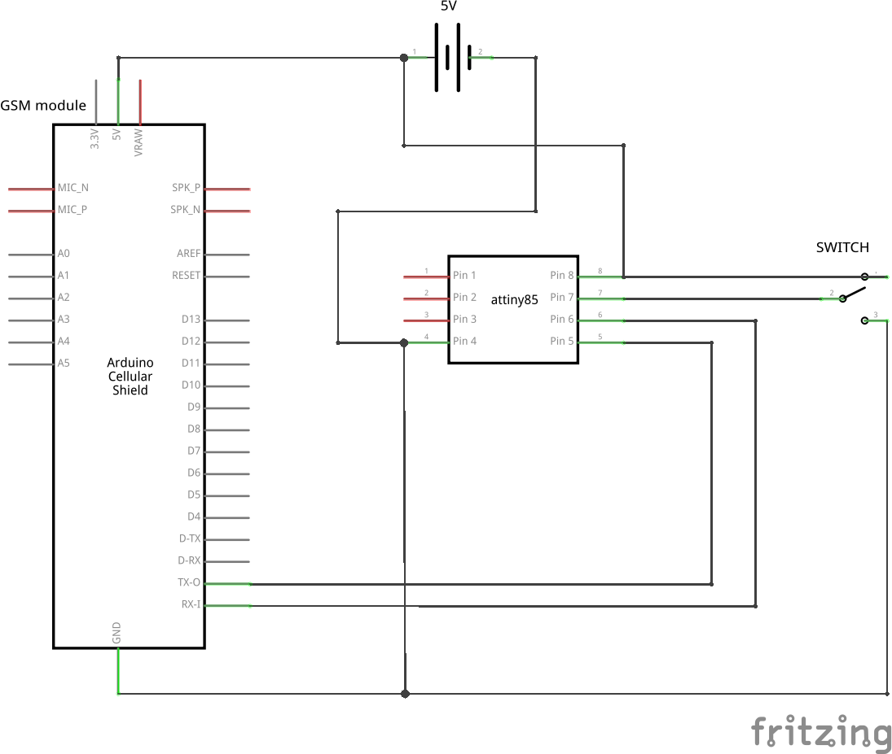
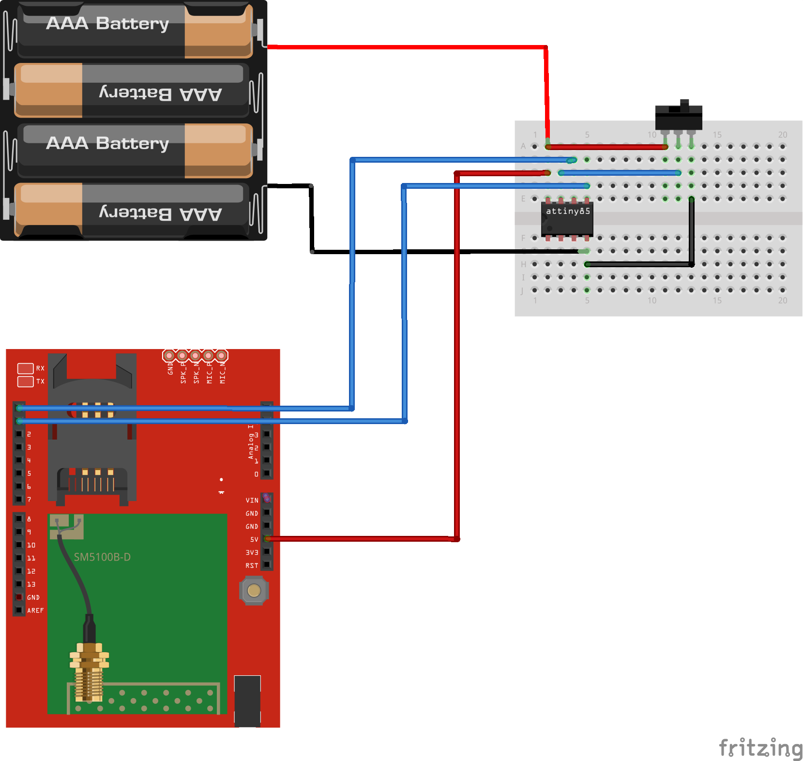
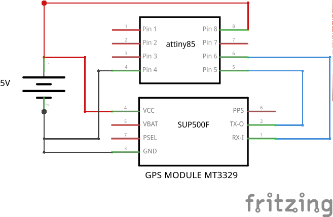
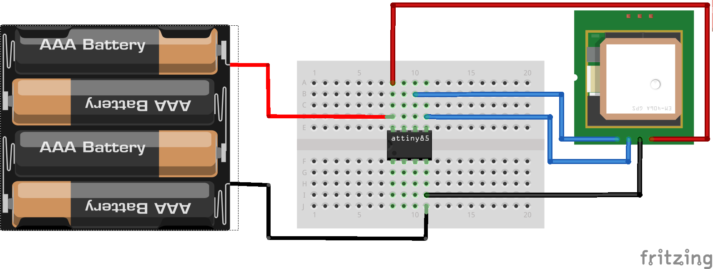
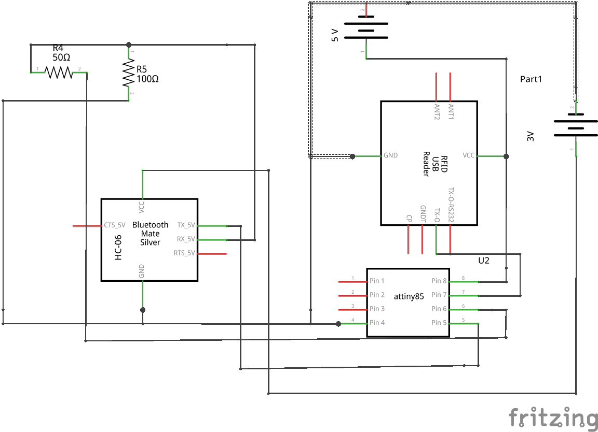
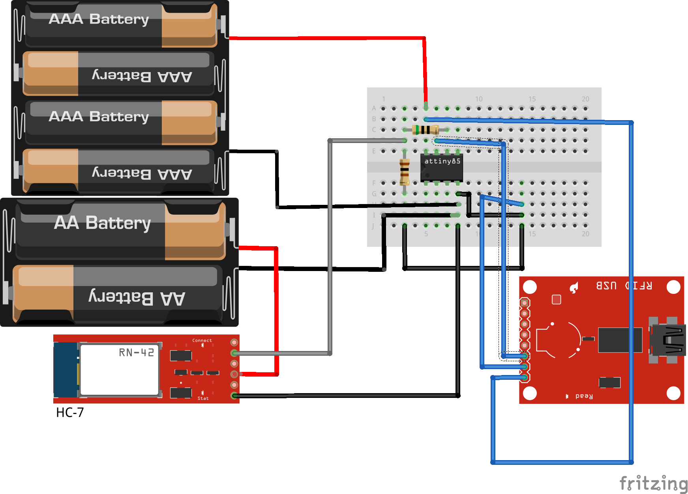

Miscellaneous modules
---------------------

GSM modems
~~~~~~~~~~

Overview of the Experiment
^^^^^^^^^^^^^^^^^^^^^^^^^^

GSM stands for Global System for Mobile Communications.It is a standard set 
developed by the European Telecommunications Standards Institute (ETSI) 
to describe protocols for second generation (2G) digital cellular networks 
used by mobilephones. This GSM Modem can accept any GSM network operator 
SIM card and act just like a mobile phone with its own unique phone number. 
Advantage of using this modem will be that you can use its RS232 port to 
communicate and develop embedded applications. Applications like SMS
Control, data transfer, remote control and logging can be developed easily.
The modem can either be connected to PC serial port directly or to any 
microcontroller. It can be used to send and receive SMS or make/receive 
voice calls. It can also be used in GPRS mode to connect to internet and 
do many applications for data logging and control. In GPRS mode you can also 
connect to any remote FTP server and upload files for data logging.This 
GSM modem is a highly flexible plug and play quad band GSM modem for 
direct and easy integration to RS232 applications.
Supports features like Voice, SMS, Data/Fax, GPRS and integrated TCP/IP stack.
A GSM Modem is a device that modulates and demodulates the GSM signals and in this
particular case 2G signals. The modem we are using is SIMCOM SIM300. It is a Tri-band
GSM/GPRS Modem as it can detect and operate at three frequencies (EGSM 900 MHz, DCS
1800 MHz and PCS1900 Mhz). Default operating frequencies are EGSM 900MHz and DCS
1800MHz.
Sim300 is a widely used in many projects and hence many variants of development 
boards for this have been developed. Sim300 GSM module used here, consists of a 
TTL interface and an RS232 interface. The TTL interface allows us to directly 
interface with a microcontroller while the RS232 interface includes a MAX232 
IC to enable communication with the PC. It also consists of a buzzer, antenna 
and SIM slot. Sim300 in this application is used as a DCE (Data Circuit-
terminating Equipment) and PC as a DTE (Data Terminal Equipment).
In this experiment we have a switch connected to PB2 of ATtiny85 interfaced with 
GSM module which sends a message "Hello world" when the pin PB2 goes high.

Components required
^^^^^^^^^^^^^^^^^^^

- Breadboard              x1
- Attiny85                x1
- GSM module              x1
- Switch                  x1
- Wires
- Powersupply(5V)

Schematic
^^^^^^^^^

Circuit Diagram
^^^^^^^^^^^^^^^

Code
^^^^

.. code-block::  c

	/*@author_Harish G*/
	#include <SoftSerial.h>
	#include <TinyPinChange.h>
	
	SoftSerial gsm(0,1);
	
	void setup()
	{
	  Serial.begin(9600);
	  gsm.begin(9600);
	  gsm.println("AT+CMGF=1");
	  delay(30);
	  gsm.println("AT+CMGS=\"+91xxxxxxxxxx\""); //mobile no. to which the msg is to be sent
	  delay(30);
	  gsm.println("Hello world");
	  delay(30);
	  gsm.write((byte)0x1A); //Ctrl+Z
	  delay(30);
	  pinMode(2,INPUT);
	}
	void loop()
	{
	 if(digitalRead(2)== HIGH)
	 {  gsm.println("Hello world");
	  delay(1000);
	  gsm.write((byte)0x1A); //Ctrl+Z
	  delay(1000);
	 }
	 if(digitalRead(2)==LOW)
	 {
	   ;
	  //delay(30);
	 }
	 }

GPS Communication
~~~~~~~~~~~~~~~~~~~~~~~~

Overview of the Experiment
^^^^^^^^^^^^^^^^^^^^^^^^^^

GPS stands for Global Positioning System. It is a space-based satellite 
navigation system that provides location and time information in all 
weather conditions, anywhere on or near the Earth where there is an 
unobstructed line of sight to four or more GPS satellites. The system 
provides critical capabilities to military, civil and commercial users 
around the world. It is maintained by the United States government and 
is freely accessible to anyone with a GPS receiver. In this experiment 
we have interfaced an anuduino board with a GPS module MT3329 to find our 
current location in terms of the latitude and longitude respectively. The 
values given by the GPS have to be divided by a factor of 10 so that they 
fall within the GPS range. For example, if the value is 37664939 and -121234543 
for latitude and longitude respectively, then divide each by 1000000 to get 
the real value. Before uploading the code, the tinyGPS library has
to be downloaded.

Components required
^^^^^^^^^^^^^^^^^^^

- Breadboard              x1
- Attiny85                x1
- GPS Module MT3329       x1
- Wires
- Powersupply(5V)

Schematic
^^^^^^^^^

Circuit Diagram
^^^^^^^^^^^^^^^

Code
^^^^

.. code-block::  c
	

    #include <SoftwareSerial.h>
    #include <TinyGPS.h>
     
    long lat,lon; // create variable for latitude and longitude object
     
    SoftwareSerial gpsSerial(2, 3); // create gps sensor connection
    TinyGPS gps; // create gps object
     
    void setup(){
    Serial.begin(9600); // connect serial
    gpsSerial.begin(4800); // connect gps sensor
    }
     
    void loop(){
    while(gpsSerial.available()){ // check for gps data
    if(gps.encode(gpsSerial.read())){ // encode gps data
    gps.get_position(&lat,&lon); // get latitude and longitude
    // display position
    Serial.print("Position: ");
    Serial.print("lat: ");Serial.print(lat);Serial.print(" ");// print latitude
    Serial.print("lon: ");Serial.println(lon); // print longitude
    }
    }
    }

RFID interfacing
~~~~~~~~~~~~~~~~

Overview of the Experiment
^^^^^^^^^^^^^^^^^^^^^^^^^^

Radio-frequency identification (RFID) is the wireless non-contact use of 
radio-frequency electromagnetic fields to transfer data, for the purposes 
of automatically identifying and tracking tags attached to objects. The 
tags contain electronically stored information. Some tags are powered by and 
read at short ranges (a few meters) via magnetic fields (electromagnetic induction). 
An RFID reader’s function is to interrogate RFID tags. The means of interrogation 
is wireless and because the distance is relatively short; line of sight between 
the reader and tags is not necessary. A reader contains an RF module, which acts 
as both a transmitter and receiver of radio frequency signals. The transmitter 
consists of an oscillator to create the carrier frequency; a modulator to impinge 
data commands upon this carrier signal and an amplifier to boost the signal enough 
to awaken the tag. The receiver has a demodulator to extract the returned data 
and also contains an amplifier to strengthen the signal for processing. A
microprocessor forms the control unit, which employs an operating system and 
memory to filter and store the data. The data is now ready to be sent to the 
network.In this experiment we are just extracting the tag ID for which we have 
used software serial library to interface bluetooth to view the tag ID on 
the phone when the RFID tag comes in range of the RFID reader.

Components required
^^^^^^^^^^^^^^^^^^^

- Breadboard              x1
- Attiny85                x1
- Bluetooth module HC-06  x1
- RFID module             x1
- RFID tags               x2
- Resistor(100 ohm)       x1
- Resistor(50 ohm)        x1
- Wires
- Powersupply(5V & 3.3V)

Schematic
^^^^^^^^^

Circuit Diagram
^^^^^^^^^^^^^^^

Code
^^^^

.. code-block::  c

	/*@author_Chandana G*/
	#include <SoftSerial.h>
	#include <TinyPinChange.h>

	#define rxPin 0
	#define txPin 1

	SoftSerial myserial(2,3);
	SoftSerial bluetooth(0,1);

	void setup()  {

	  pinMode(rxPin, INPUT);
	  pinMode(txPin, OUTPUT);
	
	  bluetooth.begin(9600);
	  myserial.begin(9600);
	
	
	}
	
	void loop() {
	
	  if(myserial.available())
	   bluetooth.write(myserial.read());
	 }

