Project - Room Automation
=========================

Project Purpose
---------------

Home automation is the residential extension of building automation. It is
automation of the home, housework or household activity. Home-automation may
include centralized control of lighting, HVAC (heating, ventilation and air
conditioning), appliances, security locks of gates and doors and other systems,
to provide improved convenience, comfort, energy efficiency and security.
The popularity of home automation has been increasing greatly in recent years
due to much higher affordability and simplicity through smartphone and tablet
connectivity. Devices may be connected through a home network to allow control
by a personal computer, and may allow remote access from the internet.

Home automation has been developed using various methods of transmission-reception
before such as Bluetooth, Zigbee, nRF etc. The aim of our project is to give the
user a low-cost automation. We are already achieving this by using the Anuduino
board instead of the Arduino. Apart from this, we are also using the Infrared
mode of communication, which is a lot cheaper than the others.

Project Overview
----------------

IR communication is one of the cheapest modes of communication and can easily
replace other modes of communication in small distance applications such as
home automation. In this project, we have automated a room using IR communication
medium with the help of an anuduino board.

The user can operate the devices in his room from his mobile phone even when
he is not at his house. The user can access the internet through his mobile
phone and can can switch on/off the devices at his home. When the user sends
a command from his phone, it reaches his PC which is located in the room
(A prerequisite to all of this is that the user must have internet on his
phone as well as his PC). Through the RS232 medium, the PC sends the data to
the master module which is situated near the PC. The master module comprises
of an IR LED transmitter, a TSOP1738 IR receiver and an anuduino board. The
device is connected to a relay which is driven by the slave module which too
consists of the IR transmitter, receiver and the anuduino board.

Now the master and the slave can communicate with each other through the IR
medium. The master sends the corresponding data to the slave to turn on/off
the device according to the user request. Once the device is on/off, the slave
sends back data to the master as an acknowledgement. This data is sent back to
the user mobile phone via the PC and the user thus can confirm whether his
request was approved or not. Apart from turning on/off devices, the app also
consists of a check status command which can simply check the status of any
device located in the room.

Infrared Communication - An Introduction
----------------------------------------

For communication purposes, we have used Infrared.
Infrared (IR) is electromagnetic radiations with longer wavelengths than those
of visible light, extending from the nominal red edge of the visible spectrum
at 700 nanometers (nm) to 1 mm. This range of wavelengths corresponds to a
frequency range of approximately 430 THz down to 300 GHz. Most of the thermal
radiation emitted by objects near room temperature is infrared.

The prime reason for using Infrared is that other wireless communication methods
viz. Bluetooth, Zigbee, RF etc are expensive which would not solve our purpose
of achieving home automation at a low cost.

Infrared Light is also known as Plain Old Heat.

**Advantages of IR Communication:**

It is common, inexpensive and easy to use wireless technology.

IR can be used for line-of-sight communications over low to moderate range.

IR is nice because of the lack of interference (except for sun and compact fluorescent lights) freedom from FCC regulation.

Higher Security: Directional nature of transmission prevents unwanted detectors to detect the signals.

**Disadvantages of IR Communication:**

Line of sight: transmitters and receivers must be almost directly aligned (i.e. able to see each other) to communicate.

Blocked by common materials: people, walls, plants, etc. can block transmission.

Short range: performance drops off with longer distances.

Light, weather sensitive: direct sunlight, rain, fog, dust, pollution can affect transmission.

Speed: data rate transmission is lower than typical wired transmission.

Two bare minimal essentials to setup any IR communication are:

IR LED (Transmitter) : To transmit IR signals/waves.

PhotoDiode or PhotoReceptor (Receiver) : To detect or capture the IR waves.

For our project, we are using 5mm IR LED as transmitter and TSOP 1738 as receiver.

IR LED(INFRARED RAY LIGHT EMITTING DIODE)
~~~~~~~~~~~~~~~~~~~~~~~~~~~~~~~~~~~~~~~~~

An IR LED, also known as IR transmitter, is a special purpose LED that transmits
infrared rays in the range of 760 nm wavelength. Such LEDs are usually made of
gallium arsenide or aluminium gallium arsenide. They, along with IR receivers,
are commonly used as sensors.

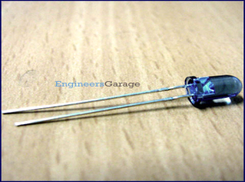

The appearance is same as a common LED. Since the human eye cannot see the
infrared radiations, it is not possible for a person to identify whether the
IR LED is working or not, unlike a common LED. To overcome this problem, the
camera on a cellphone can be used. The camera can show us the IR rays being
emanated from the IR LED in a circuit.

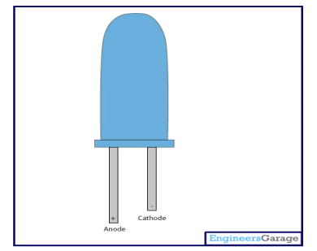

**Features:**

High reliability

High radiant intensity

Peak wavelength = 940nm

2.54mm Lead spacing

Low forward voltage

Pb Free

TSOP1738
~~~~~~~~

The TSOP 1738 is a member of IR remote control receiver series. This IR sensor
module consists of a PIN diode and a pre amplifier which are embedded into a
single package. The output of TSOP is active low and it gives +5V in off state.
When IR waves, from a source, with a centre frequency of 38 kHz incident on it,
its output goes low.

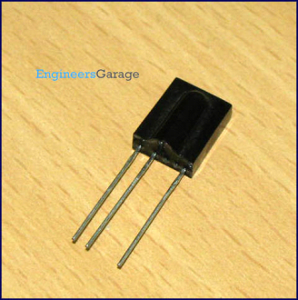

Lights coming from sunlight, fluorescent lamps etc. may cause disturbance to
it and result in undesirable output even when the source is not transmitting
IR signals. When a disturbance signal is applied to the TSOP1738, it can still
receive the data signal. However the sensitivity is reduced to that level that
no unexpected pulses will occur.

Some examples for such disturbance signals which are suppressed by the TSOP1738 are:

DC light (e.g. from tungsten bulb or sunlight).

Continuous signal at 38 kHz or at any other frequency.

Signals from fluorescent lamps with electronic ballast.

A bandpass filter, an integrator stage and an automatic gain control are used
to suppress such disturbances.

**Working of TSOP1738:**

TSOP module has an inbuilt control circuit for amplifying the coded pulses from
the IR transmitter. A signal is generated when PIN photodiode receives the signals.
This input signal is received by an automatic gain control (AGC). For a range of
inputs, the output is fed back to AGC in order to adjust the gain to a suitable
level. The signal from AGC is passed to a band pass filter to filter undesired
frequencies. After this, the signal goes to a demodulator and this demodulated
output drives an npn transistor. The collector output of the transistor is
obtained at pin 3 of TSOP module.
Members of TSOP17xx series are sensitive to different centre frequencies
of the IR spectrum. For example TSOP1738 is sensitive to 38 kHz whereas
TSOP1734 to 40 kHz centre frequency.

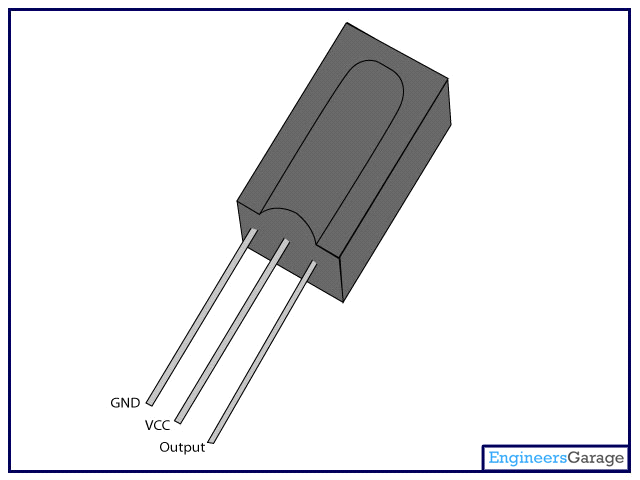

**Features:**

Photo detector and preamplifier in one package.

Low power consumption

Internal filter for PCM frequency

High immunity against ambient light

Continuous data transmission possible (up to 2400 bps).

Improved shielding against electrical field disturbance.

TTL and CMOS compatibility.

Output active low.

Suitable burst length 10 cycles per burst.

**Suitable Data Format:**

The circuit of the TSOP1738 is designed in that way that unexpected output
pulses due to noise or disturbance signals are avoided. A bandpassfilter,
an integrator stage and an automatic gain control are used to suppress such
disturbances. The distinguishing mark between data signal anddisturbance
signal are carrier frequency, burst length and duty cycle.

The data signal should fulfill the following condition:

Carrier frequency should be close to center frequency of the bandpass
(In this case it is 38 kHz).

Burst length should be 10 cycles per burst or longer.

After each burst which is between 10 cycles and 70 cycles a gap time of
at least 14 cycles is necessary.

For each burst which is longer than 1.8ms a corresponding gap time is
necessary at some time in the data stream. This gap time should have at
least same length as the burst.

Up to 1400 short bursts per second can be received continuously.

Steps involved in infrared communication
----------------------------------------

Building a receiver and transmitter pair: These are done using IR LEDS
and TSOPs and connecting each end to a microcontroller to transmit data
and/or receive data.
Modulation and Transmission: Modulating a signal is like assigning a pattern
to your data, so that the receiver knows to listen. This is essential to make
the receiver pick out signals from our transmitter among all ambient IR.

A common modulation scheme for IR communication is something called 38 kHz
modulation. There are very few natural sources that have the regularity of
a 38 kHz signal, so an IR transmitter sending data at that frequency would
stand out among the ambient IR.

The transmitted modulated signal looks somewhat like this-

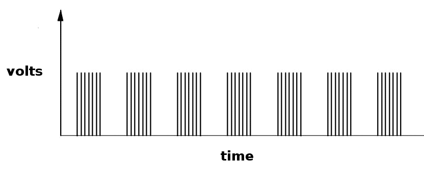

The Reception: This modulated signal is exactly what the receiving system sees.
However, the point of the receiving device is to demodulate the signal and
output a binary waveform that can be read by a microcontroller. When you read
the OUT pin of the TSOP382 with the wave from above, you will see something
like this:

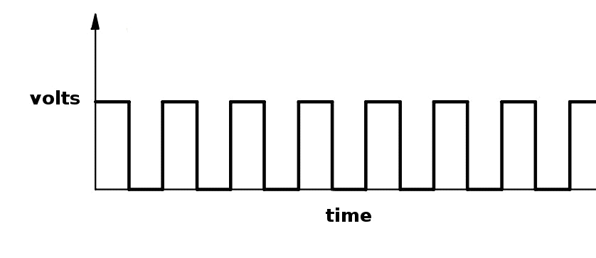

By controlling the spacing between the transmitted modulated signals, the
waveform can be read by an input pin on a microcontroller and decoded as a
serial bit stream.
Since the IR detector sends low pulses that can be measured to determine what
information the IR remote is sending, it's an example of using PWM for communication.

Hence, a conceptual view of how a general IR transmitter-receiver pair works
is shown as :

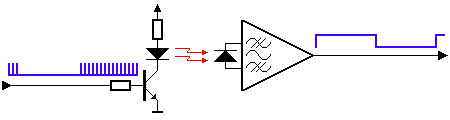

In the picture above you can see a modulated signal driving the IR LED of the
transmitter on the left side. The detected signal is coming out of the receiver
at the other side.
In serial communication we usually speak of 'marks' and 'spaces'. The 'space'
is the default signal, which is the off state in the transmitter case. No
light is emitted during the 'space' state. During the 'mark' state of the
signal the IR light is pulsed on and off at a particular frequency. Frequencies
between 30 kHz and 60 kHz are commonly used in consumer electronics.
At the receiver side a 'space' is represented by a high level of the receiver's
output. A 'mark' is then automatically represented by a low level.

Please note that the 'marks' and 'spaces' are not the 1-s and 0-s we want to
transmit. The real relationship between the 'marks' and 'spaces' and the 1-s
and 0-s depends on the protocol that's being used. More information about that
can be found on the pages that describe the protocols.

IR Communication Protocols
--------------------------

A communication protocol is a set of rules for devices that have to exchange
electronic messages. Protocols tend to have rules for voltages, the amount of
time signals last, carrier signal frequencies and/or wavelengths, and much more.
When two or more devices follow the rules of a given protocol, they should be
able to communicate and exchange information.
The IR TV Remotes use a variety of protocols for communication. We prefer to
describe the SIRC protocol used by Sony Remotes, modeling which we have
developed our protocol for communication and data transmission and reception.

Sony SIRC Protocol
~~~~~~~~~~~~~~~~~~

**Features:**

12-bit, 15-bit and 20-bit versions of the protocol exist (12-bit described here)

5-bit address and 7-bit command length (12-bit protocol)

Pulse width modulation

Carrier frequency of 40kHz

Bit time of 1.2ms or 0.6ms

**Modulation:**

The SIRC protocol uses a pulse width encoding of the bits.

The pulse representing a logical "1" is a 1.2ms long burst of the 40 kHz carrier,
while the burst width for a logical "0" is 0.6ms long.

All bursts are separated by a 0.6ms long space interval.

The recommended carrier duty-cycle is 1/4 or 1/3.

**Protocol:**

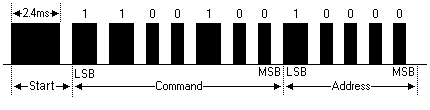

The picture above shows a typical pulse train of the SIRC protocol.

With this protocol the LSB is transmitted first. The start burst is always
2.4ms wide, followed by a standard space of 0.6ms. Apart from signaling the
start of a SIRC message this start burst is also used to adjust the gain of
the IR receiver.

Then the 7-bit Command is transmitted, followed by the 5-bit Device address.
In this case Address 1 and Command 19 is transmitted.

Commands are repeated every 45ms (measured from start to start) for as long as
the keyon the remote control is held down.

Project Description
-------------------

For our project, we have established IR communication between modules – A master
module connected to the Home PC/Laptop and a Slave Module connected to the plug
point to which the electrical appliance to be controlled is connected.

Hardware Requirements
~~~~~~~~~~~~~~~~~~~~~

- 5mm IR LED as IR transmitter.

- TSOP1738 as IR receiver.

- BC547 transistors:

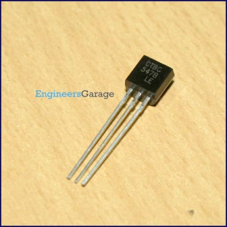

BC547 is an NPN bi-polar junction transistor. A transistor, stands for transfer
of resistance, is commonly used to amplify current. A small current at its base
controls a larger current at collector & emitter terminals.. It has a maximum
current gain of 800.

Pin Diagram:

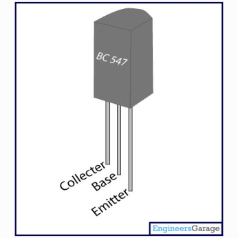

BC547 is mainly used for amplification and switching.
For amplification applications, the transistor is biased such that it is partly
on for all input conditions. The input signal at base is amplified and taken at
the emitter. BC547 is used in common emitter configuration for amplifiers.
The voltage divider is the commonly used biasing mode.
For switching applications, transistor is biased so that it remains fully
on if there is a signal at its base. In the absence of base signal, it gets completely
off.
In our circuitry BC 547 acts in the switching mode and an amplified voltage
level of IR signals is obtained. This increases the intensity if IR signals and
hence the range.

- Anuduino Board whose Attiny85 chip acts as microcontroller for the
  entire communication process.

- USB-to-RS232 Serial Cable:

This establishes one wire serial communication between attiny85 and the PC at home.
It is needed as Anuduino lacks serial port.

- 9V DC battery

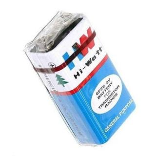

- 7805 Voltage Regulator:

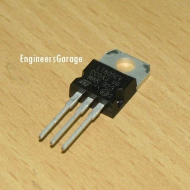

This provides regulated 5V DC Supply from 9V battery.
Pin Diagram:

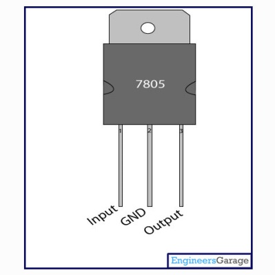

- Two 1.5 V AA batteries as separate source for the IR transmitter circuit to pump
  up more current through the IR LED.

- SWE4 Relay Module:

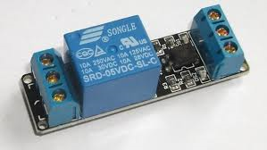

This is a small module with a 10A 230V SPCO relay on it that is ideal for use
with our SWE4 module to allow us to switch bigger loads.

- Resistances:

10Kohms     -   x2

4.7Kohms   -   x3

10 ohms      -   x2

The transmitter circuitry of both master and slave require a 10Kohm, a 4.7Kohm
and a 10Ohm resistor.
The USB-to-RS232 Serial Cable requires a 4.7Kohm and a 47Kohm resistor.

- Capacitances:

10uF           - x2

These capacitances are required at the input and output side of 7805 to reduce
ac ripples in the 5V dc output.

Software Requirements
~~~~~~~~~~~~~~~~~~~~~

- Arduino IDE(v1.0.4)

- The Arduino IDE (v1.0.4) is compatible with Digispark and is used to upload
  programs on it. All the entire coding of the IR Communication part has been
  done using this.

- Linux OS

- web2py

Block Diagram
~~~~~~~~~~~~~

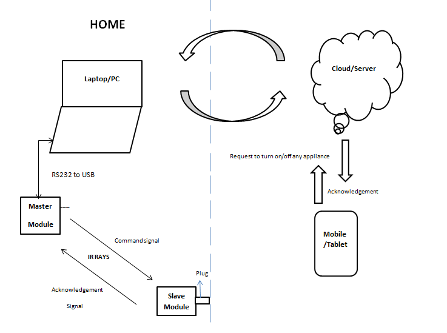

Working
-------

Steps
~~~~~

**STEP 1 & 2:**

Mobile/Tablet to Client PC via Linux Server: This is the first step where
the communication starts. The user sends a request through his mobile/tablet
to switch on/off any device. We used the web2py Web framework to prepare a
login page for the user. The user has to register at this page and his
registration details get stored in the MySQL database. Now the user can
control the devices at his home by accessing the server after he logs in at
the URL. The database stores the user ID which is unique. For any user that
registers at the URL later on, a new unique ID is allotted to him. The Python
script stores the string the user has sent in the database and then transmits
it serially to the client PC located at home. Now the string is available at
the client PC for one-wire transmission to master module and IR transmission
further to the slave. Similarly after the device has been operated by the
sent string, the slave generates a string which is received by the master and
further to the PC through one-wire serial.

**STEP 3:**

Client PC to Master module (Bi-direction Serial Debugging with a single I/O):
We have achieved communication between the PC and the master module using
single wire serial communication. <SoftSerial> is an alternative for debugging
Digispark just using a single I/O.By declaring a <SoftSerial> object with the
same pin for Tx and Rx: it's possible to use a half-duplex (request/response)
software serial port using a single I/O. The external interface is composed of
2 resistors and a regular diode (See hardware wiring below).This approach allows
to use the built-in Serial Monitor of the arduino IDE.Please note that this
solution requires a native RS232 port (rare today) or a RS232/USB adapter on
the development PC.

With this approach, the regular serial monitor of the arduino IDE can be used.
In the IDE, just select the RS232 port through the Tools→Serial Port menu.

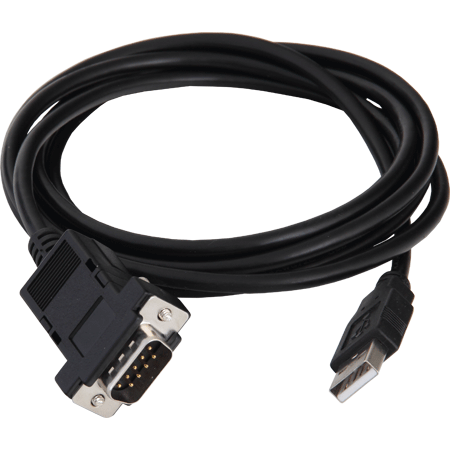

**IR Communication Protocol used in our project:**

We use 16 bit +1 bit (Start bit) binary message to communicate between
the Master and Slave Module.
The first 12 bits correspond to the address of the module for which the
message is intended.

13th bit denotes whether the message is from Master to Slave or vice versa.

1 – Master to Slave

0 – Slave to Master

14th bit denotes whether the message is a command/status request/acknowledgement/
status response.

i.e. the 13th and 14th bit can be combined and the operations can be classified as:

Bit 13 - 0, Bit 14 - 0 : Acknowledgement from slave to master
Bit 13 - 0, Bit 14 - 1 : Status response from slave to master
Bit 13 - 1, Bit 14 - 0 : Command from master to slave
Bit 13 - 1, Bit 14 - 1 : Status request from slave to master

15th bit denotes whether it is an ON command/acknowledgement or OFF command/acknowledgement.
1 – ON

0 – OFF

The 16th bit is unused and by default it is set to 1.

The transmission of the 16+1 bit data is achieved in following steps:

Generation of a Carrier signal: A 38 kHz signal is generated to modulate
the incoming data bits. This is essential to make the receiver sensitive
to the incoming message signal only and not to ambient IR radiations.

Pulse Width Coding: The message bits are pulse width modulated with the
carrier.

The 1s are represented by a pulse width of 2.4 ms .i.e. the 38 kHz signal
is repeated 96 times.

The 0s are represented by a pulse width of 1.2 ms .i.e. the 38 kHz signal
is repeated 48 times.

In short, for a binary 1 we generate a burst of 38 kHz carrier lasting for
2.4ms and for a binary 0 we generate a burst of 38kH carrier lasting for 1.2 ms.

Addition of start bit: A start bit of 4.8 ms is added before the 16-bit message
signal. The receiver detects the start bit first then only it processes the
message bits.

In between each bit .i.e. each mark, a space of 2.6 ms is given. The modulated
signal remains LOW for these 2.6 ms. This is done in accordance with the
TSOP1738 specifications which are mentioned before.

Hence the final train of pulses looks like this:

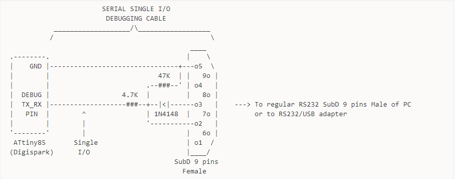

**STEP 4:**

Master module to Slave Module and vice versa:
As stated earlier, we have developed a master module viz. connected to the
home PC and a Slave module connected to the plug point.

The Master gives commands to the Slave to turn ON/OFF any electrical appliance
connected to it. The Slave responds to the Master’s request and sends back an
acknowledgment to the Master to let it know that the job is completed.

The entire communication between Master and Slave Module is through InfraRed.

Master and Slave Modules Descriptions
~~~~~~~~~~~~~~~~~~~~~~~~~~~~~~~~~~~~~

Master Module
^^^^^^^^^^^^^

The master module consists of-

- IR LED

- TSOP1738

- BC547 transistors

- Anuduino Board

- Two 1.5V batteries in series

- USB-to-RS232 Serial Cable

- USB-to-USB Cable

- Resistors and Capacitances

**Circuit Diagram:**

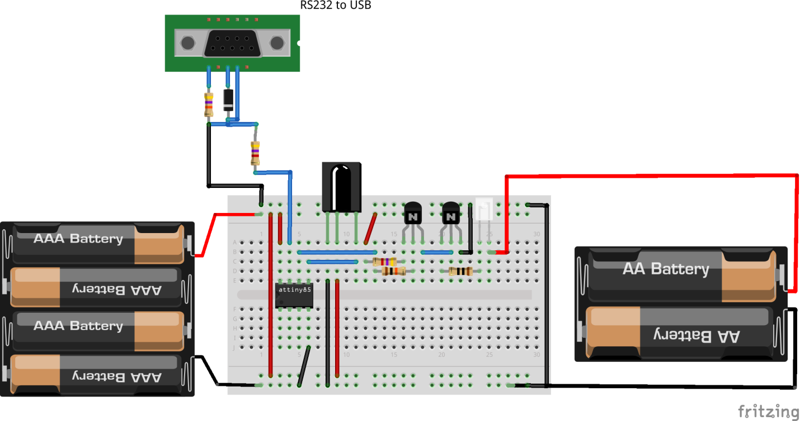

**Schematic:**

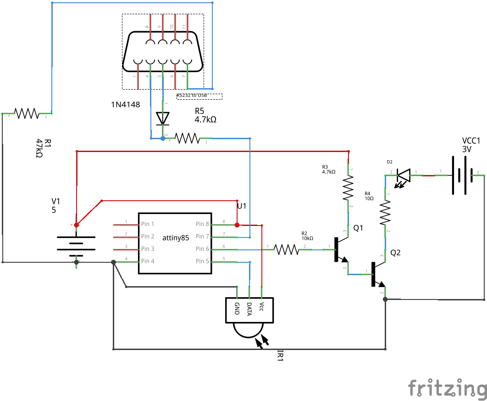

Slave Module
^^^^^^^^^^^^

The Slave Module consists of-

- IR LED

- TSOP1738

- BC547 transistors

- Attiny85 IC chip

- 9V Battery

- 7805 Voltage Regulator

- Relay Module

- Resistances and Capacitances

We have made the Slave Module in form of a box analogous to a 3-pin plug.
The electrical appliance fits to one side of the box and the other side
goes to the 230V mains.

**Circuit Diagram**

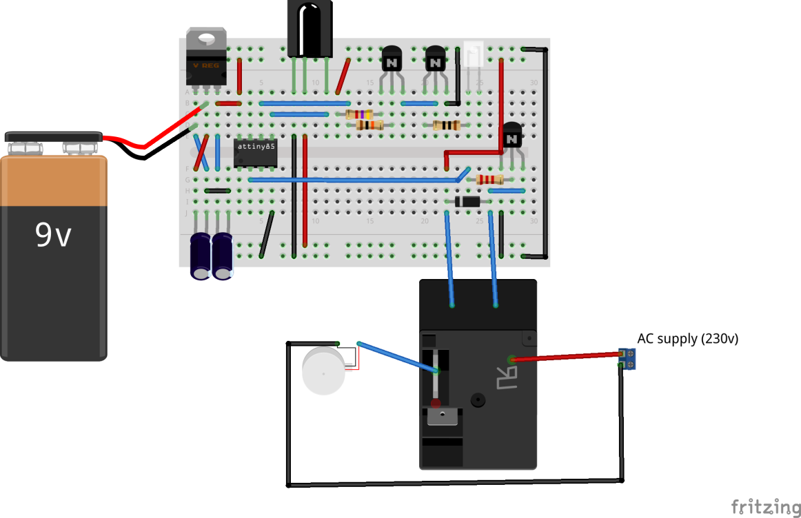

**Schematic**

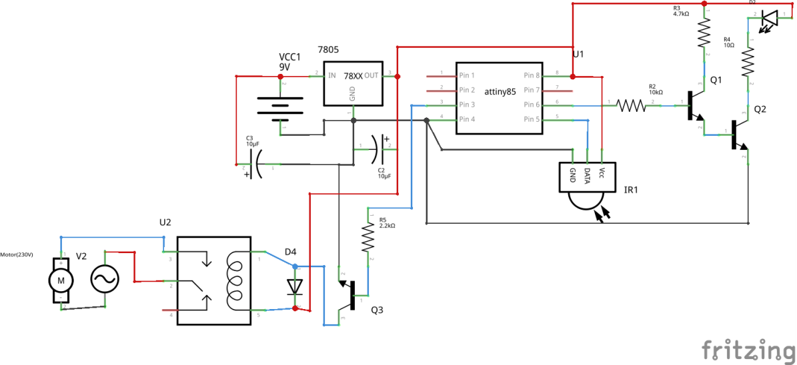

The entire process of communication between the Master moduleand Slave Module is
explained as follows:

The 16 bit serial data is received by the Attiny85 of the master through the
USB-to-RS232 Serial Cable as explained in Step III.

The Attiny85 of the Master encodes that 16-bit data using Pulse Width
Modulation (PWM). The entire protocol for the PWM process has already been explained
before.

The Attiny85 also appends a start bit to the serial data and transmits the
entire pulse stream in form of IR signals.

The receiver of the Slave Module receives those train of pulses and again
decodes the entire pulse stream in binary form using pulseIN() function.

The pulseIN() function measures the pulse width of each pulse. When it receives
the start bit of pulse width 4.8ms then it assigns a 1 or 0 to the remaining
pulses depending on their duration.

After decoding the pulses, the receiver compares the first 12 bits meant for
address with its own unique Module ID. If it doesn’t match, the Slave rejects
the data signals.

If the Module ID matches, the Attiny85 of the Slave turns one pin HIGH or
LOW depending on the last 4 data bits. The nomenclature for the last 4 data
bits has already been explained before.

The pin which gets HIGH or LOW is connected to the input of the relay and the
relay accordingly turns ON/OFF thus switching the electrical appliance to 230V
mains.

Finally, the transmitter of the Slave Module sends acknowledgement bits through
PWM to the Master.

The receiver of the Master decodes the acknowledgement pulse stream and
through USB-to-RS232 serial cable transmits it to the webapp on the user’s
mobile/PC thus, confirming the user that his desired action has been performed.

.. image:: ../images/mastermodule.png

.. image:: ../images/slavemodule1.png

.. image:: ../images/slavemodule2.png

Flowcharts
~~~~~~~~~~

Master Module
^^^^^^^^^^^^^

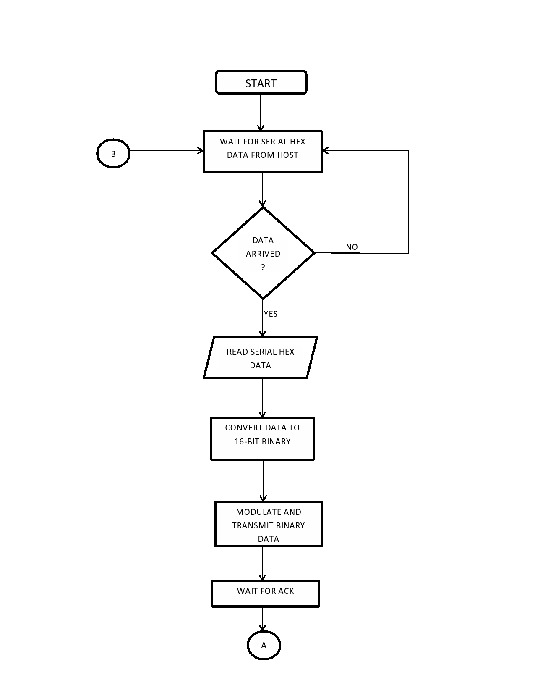

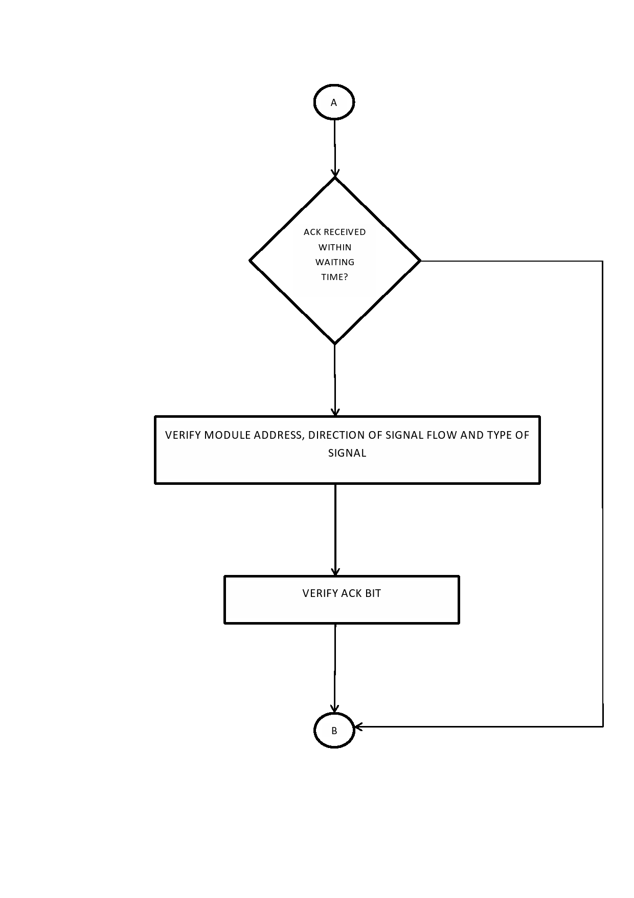

Slave Module
^^^^^^^^^^^^

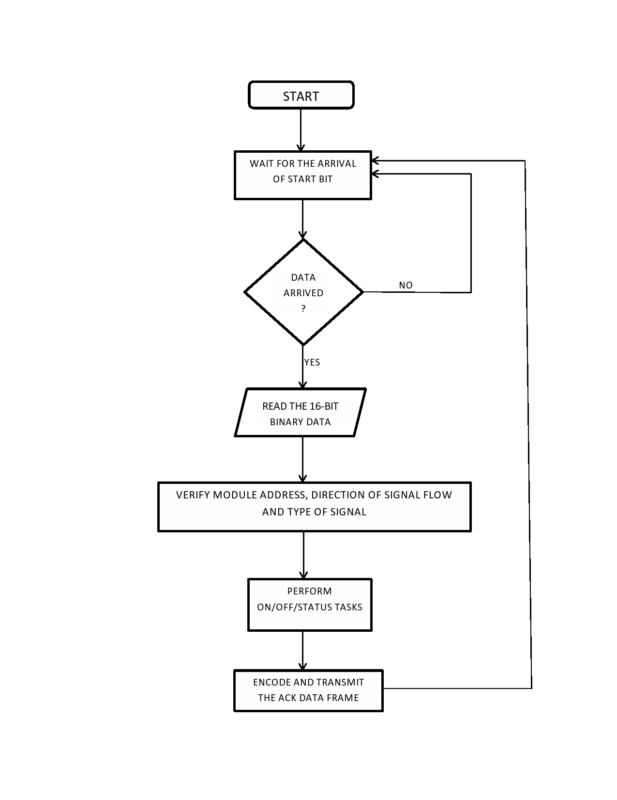

Codes
-----

(For the codes of the master and the slave modules, refer to the appendix)

Limitations
-----------

1. IR communication is restricted to line of sight i.e IR signals sent
from the master module cannot penetrate through obstacles.

2. As distance increases, errors creep into the IR message signal;
higher magnitudes of errors may lead to rejection of the message signal
by the slave module or the acknowledgement signal at the master module.

3. The reliability of IR communication is inversely proportional to distance.

4. IR signals are quite directional in nature. Hence IR LEDs have to pointed
in the direction of the Slave Module.

Future Enhancements
-------------------

We have demonstrated our project for a single master – single slave module.
For multiples slave modules located in a single room, it is quite easy for
the master to communicate with the other slaves through direct infrared
transmission-reception. Each module has a unique ID and accepts only that
data from the transmitter which contains its first 8 bits as its device ID.
So when a user intends to switch on/off any device, the request reaches
the master module and it sends the data across the room. The master module
will have multiple IR LED’s on it to achieve IR transmission in all directions.
Corresponding to the device ID in the data sent by the master, the slave having
the same device ID will accept the data and operate the device connected to
it accordingly.
If the user intends to achieve complete home automation at a very low cost,
our project can be enhanced for that purpose of-course after a few sacrifices.
Unlike the RF and Bluetooth, IR has a line of sight problem which makes the
transmission of IR rays from one room to another very difficult. But due to
the low cost that it offers, we can use repeaters in between two rooms that
can allow the transmission of IR from one room to another. These repeaters
won’t operate any device but would just serve the transmission and reception
of IR from one room to another. This will increase the number of modules but
as the cost of a single module is pretty less, it is definitely worth it.

Another important enhancement that can be achieved in our project is the
distance at which IR transmission and reception occurs. If the hardware
can be bettered to achieve IR transmission and reception across a complete
room, the number of modules needed would reduce. This will also give freedom
to the user regarding where he wishes to place the modules in his room.

We have given a unique device ID to each slave module that is to be operated.
Right now, we are using a 12-bit device ID with 4 control bits making it
16-bit data. This can generate 2^12 = 4096 combinations allowing the operation
of 4096 devices. As a future enhancement this number can be easily increased
to about 32-bit device ID allowing the operation of 2^32 devices.

The acknowledgement that we generate is right now getting received at the
client PC. The server can be further coded to make the acknowledgement available
on the mobile/tablet. Further we have also placed a status LED on the slave
hardware. The control bits in the code can be assigned so that the status LED
glows when there is a finite connection between the master and the slave.

